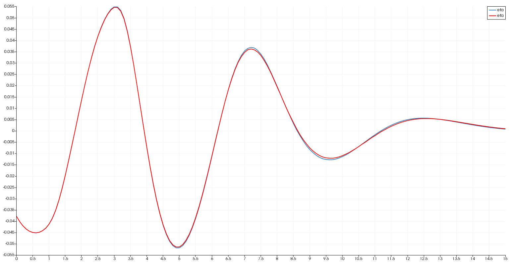
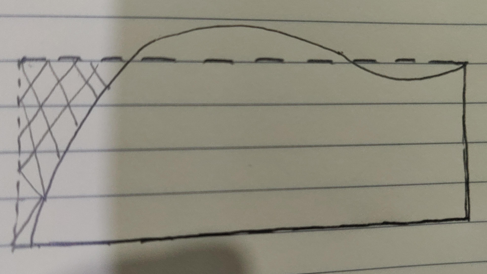
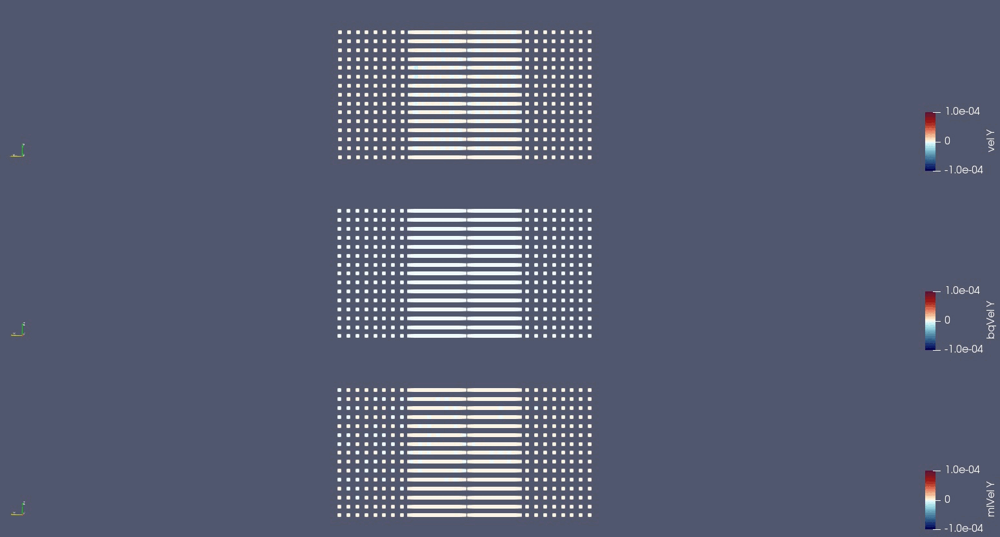

# Initial development log

1. [Compile and run both together [2020-05-16]](#log_wbqml01_v0001_1)
1. [Set-up Bsnq coupling region inside MLPGR [2020-06-02]](#log_wbqml01_v0001_2)
1. [Coupling Approach 1 : Pressure as MLS [2020-06-05]](#log_wbqml01_v0001_3)
1. [Periodic reinit MLPGR mesh using Bsnq and MLPGR data [2020-06-07]](#log_wbqml01_v0001_4)
1. [Updated to MLPG (e1c8319) and Bsnq (dce3b61) [2020-06-25]](#log_wbqml01_v0001_5)

## Attempting

## List of Work
- [x] Compile the two codes together.
- [x] Run the two codes together without coupling
- [x] Extract velocity from Bsnq at xyz
- [x] Disabled _FIND_ACCN()_ as it was doing nothing
- [x] Coupling Approach 1 : Pressure as MLS extrapolation on type8
	- [x] [Disabled _FIND_LAPLAC_](#log_wbqml01_v0001_3_1)
- [x] Periodic reinitialisation of MLPGR mesh with data from Bsnq and MLPGR

## Bookmarks for coupling

### MLPGR
- [x] interpNew.f90 : Disable the pressure Dirichlet for type8
- [x] OUTPUT()
- [x] Wavemaker in CYLIND() : NWALLID(NNI,3) = 9
- [ ] Resume functions
- [ ] Remeshing

### Bsnq
- [x] Basic

-----------------------------------------------

## Updated to MLPG (e1c8319) and Bsnq (dce3b61) [2020-06-25]

### MLPG Updates
- Stationary bottom nodes with wetting and drying of the bottom nodes
- Multiple bug fixes, such as mistake of fixing of top right corner.
- Removed multiple old variables and subroutines which were no longer in use
- The MLPG code has a resume functionality now.
- The MLPG code gives the Paraview output at the time-step where it fails to solve the pressure Poisson equation

### Bsnq Updates
- The wave input is interpolated to the simulation time-step using Cubic spline method instead of the linear interpolation being used in the older version
	- This has slight influence on the results on Bsnq as seen in the figure below, where the wave input was taken from a FNPT file. Eta Old (Linear interp) Blue vs Eta New (Cubic Spline interp) Red 
	
- Modification of the LS Paralution solver with my own custom code which which create the solver objects in C++ at the beginning of simulation and hence avoid the recreation which was done earlier at every solver call.
- Multiple modification related to ship pressure field implementation.
- Inclusion of velocity probes in the input file
- Bottom friction is implemented using quadratic law with Manning coeff.
- Time ramping of the wave input is possible.
- **The z ref for depth resolved velocity is shifted from bottom to mean sea level**. z=0 is mean sea level now.

-----------------------------------------------

## Periodic reinit MLPGR mesh using Bsnq and MLPGR data
- We have not implemented any particle shifting technique (PST).
	- Very limited success.
- Instead in MLPGR we periodically reinitialise the MLPGR mesh to the T0 mesh.
- Due to the flow being Lagrangian, the MLPGR nodes move in the direction of the wave (assumed here to be from left to right). 
- Therefore we cannot use just the MLPGR nodes to interpolate the values from the current mesh to the initial mesh. 
	
- In FNPT coupled code, data was taken from the XZ plane of FNPT and then repeated at regular intervals in Y direction to generate nodes for the shaded region uncovered by the T(n) mesh.
- The algorithm is briefed below.

|      |      |
| :--- | :--- |
| Abbreviation | IM = T(0) mesh   CM = T(n) mesh |
| Step 1 | Get the FS for the entire region by combining the FS of FNPT (for the shaded area) and MLPGR CM. |
| Step 2 | Interpolate the elevation onto the IM   Assumes continuous and non-breaking FS |
| Step 3 | Get the values of P and velocities inside the shaded region using FNPT XZ plane repeated along Y at regular intervals. |
| Step 4 | Interpolate values of P and velocities onto the IM using values from CM and FNPT |

- This appraoch gave reasonably good and stable results. It was quite a challenging piece of code.
- It was crucial to ensure the particle distribution around the cylinder was proper, without which our code kept breaking 
- A thing to note is that the pressure inside the shaded region will not be the pressure that would have been achieved using MLPGR, although it wont be too bad because FNPT is quite accurate
	- **Note that the pressure inside the relaxation zone has to be ignored**
	- **Also note that reinit of the mesh should be done often enough to avoid the shaded region going out of the relaxation zone (based on T(0))**

Now to couple with Bsnq we have to do a similar implementation.

- **The pressure in the shaded area will be even worse because Bsnq pressure is quite inaccurate**
	- This should not effect the results because the MLPGR calculated pressure only relies on U\* vel.
	- Remember that at remeshing intervals the pressure displayed will be in-accurate in the shaded area of the relaxation zone. At every other time-step Bsnq pressure played absolutely no role. 
	-  **Therefore ensure that Paraiew output interval is not the same as remeshing interval to see accurate pressure**  
- The algorithm should be as follows.

|      |      |
| :--- | :--- |
| Abbreviation | IM = T(0) mesh   CM = T(n) mesh |
| Note | Do the remeshing before running the Bsnq time-step.
| Step 1 | Take FS of MLPGR CM. Take FS from Bsnq inside the relaxation zone + some buffer around it on the outside of the domain. |
| Step 2 | Interpolate the elevation onto the IM   Assumes continuous and non-breaking FS |
| Step 3 | Get the values of P and velocities inside the shaded region using Bsnq **Pressure will be inaccurate but doesnt matter** |
| Step 4 | Interpolate values of P and velocities onto the IM using values from CM and Bsnq |
| Step 5 | Apply boundary condition for wall velocities to ensure remove possibilities of error for wall normal velcities. |

-----------------------------------------------

## Coupling Approach 1 : Pressure as MLS [2020-06-05]
- The pressure and vertical velocity extracted from Bsnq at a given depth are not very accurate. Comparatively the horizontal velocity is pretty decent.
	- This is due to the time derivative in pressure and third x derivative in vertical velocity.
- Therefore attempt is being made at avoiding use of atleast pressure from Bsnq.
- For this we cannot use the Dirichlet BC for pressure as was done in FNPT coupling.
- Therefore for solving the pressure Poisson eqn, the boundary condition for type8 face (coupling face) has two possible approaches
	1. Approach 1 : Pressure on type8 nodes done using implicit MLS extrapolation
	2. Approach 2 : Wall boundary condition at type8 face, i.e. &nabla; P . n = 0
- **There is one major problem with Approach 2**
	- As the type8 face moves in Lagrangian manner with velocity from Bsnq, it will behave like internal fluid and will have a continuously changing face.
	- Therefore to apply &nabla; P . n = 0, we will have to continuously calculate the normal at each node.
		- This process may actually be wrong
		- Anyway calculation of normal at type8 nodes will be a difficult task in mfree (compared to a FEM surface)

**Therefore Approach 1 seems like a method to try** 
The algorithm for this is briefly described below.

|       |       |
| :---: | :---- |
| Variable definition | bqu0 = bqu(n)   bqu1 = bqu(n-1)     mlu0 = mlu(u)   mlu1 = mlu(n-1)     mlp0 = mlp(n)   mlp1 = mlp(n-1)  |
|  |  |
| Start Time step n | Known values bqu1, mlu1, mlp1 |
| Step 1 | mlu* = mlu1 + viscosity term     For type8 :   Anyway mlu1 = bqu1   mlu* = bqu1 + viscosity (=0 anyway in this region) = mlu1 |
| Step 2 | P0 = mlp0   &nabla;2 P0 = &rho;/(&Delta;t) &nabla;u*     For type8: Apply MLS extrapolation on all type8 nodes |
| Step 3 | mlu0 = mlu* - (&Delta;t)/&rho; &nabla;P0    Calculate bqu0 from bqu1 in Bsnq |
| Step 4 | In Relaxation zone :   mlu0 = w\*bqu0 + (1-w)\*mlu0     For type8 : mlu0 = bqu0   Do not apply velocity BC on type8 nodes.|
| End Time step n | Known values bqu0, mlu0, mlp0 |

The relaxation zone in MLPGR is determined only at T0 and then those nodes remain as coupling nodes for the entire simulation.

This algorithm was applied and it showed very promising results! But it had a few issues as shown below.

The first test case tried is for simple Airy wave of T=2s, H=0.1m, d=0.7m, kh=0.95.  
The Bsnq case is ftc1 and a MLPGR mesh of DDL = 0.04375m was used with dt = 0.0075

| Result 1 |
| :-------------: |
| **Figure :** Pressure in MLPGR and Bsnq node in pink showing moving free-surface |
|  |
| **Figure :** Velocity X in BQML, Bsnq, MLPGR respectively. The last two only shown for relaxation zone nodes. |
|  |
| **Figure :** Velocity Z in BQML, Bsnq, MLPGR respectively. The last two only shown for relaxation zone nodes. |
|  |

The observations from the above gifs are:

- Check the pressure gif to see that near the left face the pressure is quite incorrect.
	- It even varies un-naturally near the left face with a oscillating behaviour over time
	- The velX on the left face seems incorrect in the MLPGR solution. Obviously once the Bsnq result is superimposed on top of the MLPGR solution that issue goes away, as seen in the BQML solution.
		- **This velocity anomaly is probably causing or is a result of the pressure anomaly**
	- velZ seem smooth and correct in BQML, Bsnq and MLPGR, with both Bsnq and MLPGR having similar visual trends.
	- The free surface as compared between Bsnq and MLPGR seems to mathc very well, though it will have to be confirmed using wave-probes.
	- There is however some particle crowdin in the relaxation zone.
		- I feel it is because of the un-natural pressure.
		- Sir suggested it might be because of the relaxation zone function.			

### Removed _FIND_LAPLAC_ to solve the above issue 
- This subroutine is doing two functions
	1. Setting some normal velocities based on boundary type. This is quite confusing and seems unnecessary.
	2. **Remove the normal component of U\* vector**

**The second function of this subroutine mentioned there is quite important actually.**

- In intermediate velocity calculation we do  
	u* = u(n-1) + viscosity term
- The u(n-1) already has the normal velocity BC applied in the previous time step. 
- However the vicosity term may introduce additional normal velocity components.
- This function calculates the intermediate velocity and then assuming that the viscosity term is applied, it removes the normal component of u*
	- **In Bsnq weak coupling that was causing the issue as shown in above observations!**
	- In Bsnq coupling pressure Dirichlet BC is not applied due to the reasons mentioned within Approch 1 description and instead MLS extrapolation is applied.
	- So this purely relies on the knowledge of velocity gradient in the vicinty of the relaxation zone to calculate the pressure. 
	- Now probably this function was doing the right thing by removing the normal component of u* on _walls_, not 100% sure though.
		- **Is BC supposed to be applied on u\* ?**
	- However because the walls in all our cases till now are non-viscous, this function was not necessary, because for every wall node u* = u(n-1)
	- Moreover in the Bsnq coupling the type8 node is no longer a wall so this BC of u_normal = 0 is not even supposed to be applied.
	- Therefore the artifical application of u* . n = 0  was causing the pressure to come wrong and further causing particle crowding issues.
		- This issue did not show up in FNPT coupling as we were directly using the pressure from FNPT.
		- Hence a lot of things thankfully worked in FNPT purely because we had velocities and pressures! We did make a lot of mistakes there but those didnt matter.
	- The same description is written in log_mlpgrv01_v0002.md

After removing _FIND_LAPLAC_ the following results were achieved. 
Airy wave of T=2s, H=0.1m, d=0.7m, kh=0.95.  
The Bsnq case is ftc1 and a MLPGR mesh of DDL = 0.04375m was used with dt = 0.0075

| Result 2 |
| :-------------: |
| **Figure :** Pressure (XZ plane) in MLPGR and Bsnq node in pink showing moving free-surface |
|  |
| **Figure :** Velocity X (XZ plane) in BQML, Bsnq, MLPGR respectively. The last two only shown for relaxation zone nodes. |
|  |
| **Figure :** Velocity Z (XZ plane) in BQML, Bsnq, MLPGR respectively. The last two only shown for relaxation zone nodes. |
|  |
| **Figure :** Velocity Y (XZ plane) in BQML, Bsnq, MLPGR respectively. The last two only shown for relaxation zone nodes. |
|  |
| **Figure :** Velocity Y (YZ plane) in BQML, Bsnq, MLPGR respectively. The last two only shown for relaxation zone nodes. |
|  |

The observations from these results are as follows

- The issue with the pressure in the relaxation zone, and especially near the left face is solved
	- The pressure is no longer oscillating over time as it was in the Result 1.
	- The pressure is more smoothly varying compared to Result 1.
	- There is much lesser crowding of nodes in the relaxation zone, which means the earlier crowding was due to the pressure gradient mostly.
- The free surface comparison between Bsnq and BQML looks good. Though verification needs to be done using probes.
- The removal of _FIND_LAPLAC_ has resolved the issue with velX along the left face as was discussed in Result 1.
- The velZ is smooth as before.
- velY is mostly very small inside the relaxation zone as seen in the gifs above from two angles.
	- The small velY on the left face in MLPGR result is expected due to the nature of pressure poisson solution. But the velocity signs being opposite means the result mostly is not incorrect and is purely because of a lack of Dirichlet or Neumann BC at left face.
	- Anyway it doesn't influence the BQML result becuase other than the left face velY is close to 0 throoughout the relaxation zone. This indicated its just a BC artifact and is anyway totally superimposed by Bsnq.

-----------------------------------------------

## Set-up Bsnq coupling region inside MLPGR [2020-06-02]
- Made _BSNQCPLMOD_ inside _bsnqCoupling.f90_ based on _FNPTCPLMOD_ inside _fnptCoupling_
- It takes user input for X0 and Y0 to place MLPGR domain inside the Bsnq domain.
- It also identifies the nodes in MLPGR lying inside the relaxation zone.
- Need to think on how to handle the type8 nodes. 
- **FILE-1 : 'mlpgr3D/mlpgrv01/Dev - Logs/log_mlpgrv01_v0002.md'**
- **Read FILE-1** to see all the subs that are using boundary nodes and how they are using the boundary nodes. Its also lists all NWALLID(:,:) values and their meaning.
- As per FILE-1, _FIND_ACCN_ serves no purpose and is being removed. Also removing variable _UM(LNODE)_

-----------------------------------------------

## Compile and run both together [2020-05-16]
- Using the .f90 converted _mlpgrMain.f90_
	- Better colouring in Sublime Text for .f90 compared to .f, especially for objects.
	- Most subroutines in _mlpgrMain.f_ were not going to be changed in _bqml_. All of those were moved to _mlpgrMainSubs.f_ in _mlpgr3D_

-----------------------------------------------

# References
