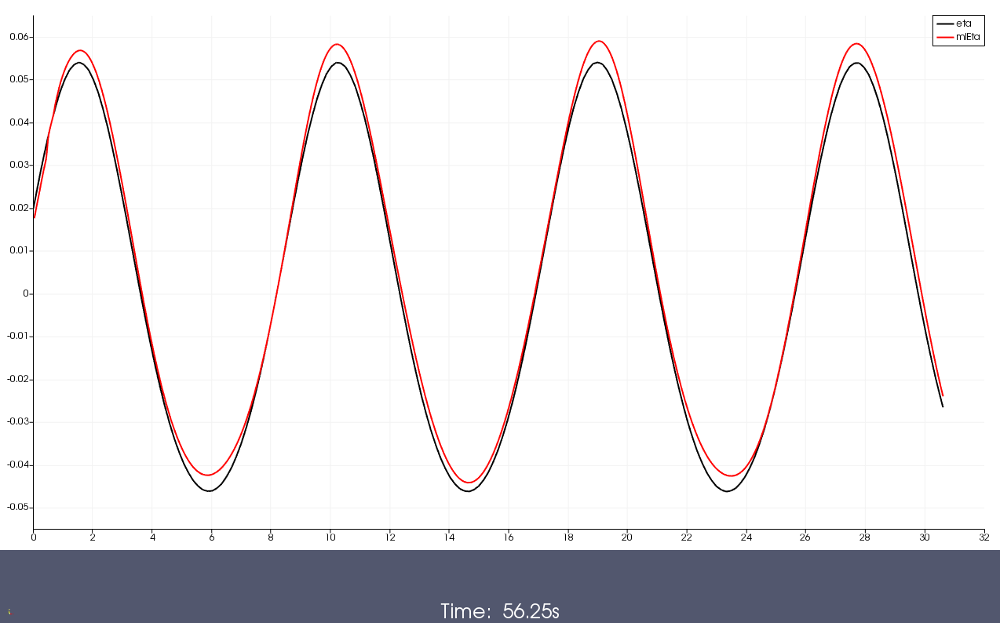
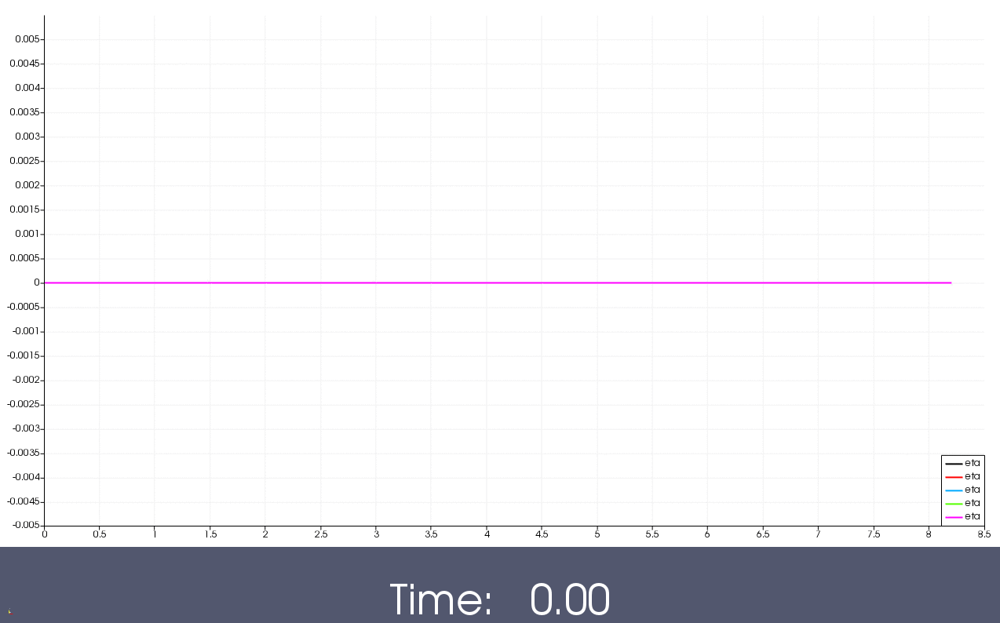

# Bsnq-MLPG 3D coupling

1. [Trials of input from all 4 directions [2021-12-15]](#log_wbqml01_v0002_1)
	- [Update [2021-12-28]](#log_wbqml01_v0002_1b)
	- [Update [2021-02-11]](#log_wbqml01_v0002_1c)
1. [Domains used in 3D coupling [2021-12-16]](#log_wbqml01_v0002_2)
	- [Revised [2022-02-11]](#log_wbqml01_v0002_2b)

## Attempting

## List of Work
- [ ] **BUG** I do not correct the velocity and pres at new position once I vertically adjust the nodes using BsnqEta. Correct this.

## Bookmarks for coupling

### MLPGR
- [x] interpNew.f90 : Disable the pressure Dirichlet for type8
- [x] OUTPUT()
- [x] Wavemaker in CYLIND() : NWALLID(NNI,3) = 9
- [ ] Resume functions
- [ ] Remeshing

### Bsnq
- [x] Basic

-----------------------------------------------

## Domains used in 3D coupling [2021-12-16]

Please check the complete revision [here](#log_wbqml01_v0002_2b)

There are 4 types of domains in the coupling

| Domain | Description |
| ------ | ----------- |
| CPLSTAT0 | Pure MLPG fluid nodes |
| CPLSTAT1 | MLPG nodes   Overlapping Bsnq zone   BsnqUX BsnqUY based on t(n) coords are combined with the MLPGUX MLPGUY at t(n) coords using Altomare (2018) weight fnc. |
| CPLSTAT2 | MLPG nodes   Overlapping Bsnq zone   BsnqUX BsnqUY based on t(n) coords are enforced while the nodes are at location t(n).  Further zCoord based on eta from t(n+1) X,Y positions are enforced while the nodes are at location X,Y t(n+1) |
| CPLSTAT10 | These nodes are nwid2-10. Hence they are not a part of the MLPG computation at all   These are purely moved by BsnqUX BsnqUY BsnqUZ.   They are just representative of particle purely driven by Bsnq vels. |

### Revision [2022-02-11]

There are 5 types of domains in the coupling. Out of these three are relevant to coupling.

| Domain | Description |
| ------ | ----------- |
| CPLSTAT0 | Pure MLPG fluid nodes |
| CPLSTAT1 | MLPG nodes   Overlapping Bsnq zone   BsnqUX BsnqUY based on t(n) coords are combined with the MLPGUX MLPGUY at t(n) coords using Altomare (2018) weight fnc.   Further zCoord based on eta from t(n+1) X,Y positions is also ramped while the nodes are at location X,Y t(n+1) |
| CPLSTAT2 | MLPG nodes   Overlapping Bsnq zone   BsnqUX BsnqUY based on t(n) coords are enforced while the nodes are at location t(n).  Further zCoord based on eta from t(n+1) X,Y positions are enforced while the nodes are at location X,Y t(n+1) |
| CPLSTAT3 | MLPG nodes   Overlapping Bsnq zone   BsnqUX BsnqUY BsnqUZ based on t(n) coords are enforced while the nodes are at location t(n).  Further zCoord based on eta from t(n+1) X,Y positions are enforced while the nodes are at location X,Y t(n+1) |
| CPLSTAT10 | These nodes are nwid2-10. Hence they are not a part of the MLPG computation at all   These are purely moved by BsnqUX BsnqUY BsnqUZ.   They are just representative of particle purely driven by Bsnq vels.   They play no role in coupling interface.   Not necessary to even include them at all   They can be useful just to show what will happen if we only move nodes using Bsnq vel without correctingt the vertical position using &eta; |

Brief about the variables and the user control.

| Domain | Description |
| ------ | ----------- |
| CPLSTAT0 | Pure MLPG fluid nodes |
| CPLSTAT1 | Ramp UX UY Eta   User choice for UX UY UZ Eta |
| CPLSTAT2 | Enforce UX UY Eta   User choice for UX UY UZ |
| CPLSTAT3 | Enforce UX UY UZ Eta |

-Earlier we were essential using CPL1 and CPL3, and not ramping Eta in CPL1.

- This had the issue that the CPL1 nodes which had CPL3 in their velocity smoothing radius would be using the inaccurate BsnqUZ vel. That lead to creating of a little bit of a hump in the Eta profile, which lead to an increase in the surface elevation by a little bit. 
	- The following is an example case, where I am running CPL3 next to CPL1, not raming eta in CPL1 and using MLS for pressure interpolation and pressure smoothing.   
	Folder: "Test_checksfdi_caseS1a / bqml46MLS_caseS1a_dx062_dt010_r06_L110_L01R00_spng100B02_Walt"    
	- The following is an example case, where I am running CPL3 next to CPL1 but not using BsnqUZ in CPL3, not raming eta in CPL1 and using MLS for pressure interpolation and pressure smoothing.   
	Folder: "Test_checksfdi_caseS1a / bqml46MLS_caseS1a_dx062_dt010_r06_L110_L01R00_spng100B02_Walt_CplStat2noCplUZ"    
	- We can clearly see that there is a hump in elevation at the interface between CPL1 and CPL3, due to the inaccurate BsnqUZ being used in the smoohting of the CPL1 node.
	- By using a CPL2 zone in between and further by also ramping eta in CPL1 we minimise this issue.

- Therefore, I kept trying to make the coupling interface work without using BsnqUZ at all. This however proved to be quite difficult and unrealiable at the boundary nodes, expecially when we didnt have any walls (in the case of 4 coupling interfaces.)

- So I resorted to the current procedure, where CPL3 ensures that the boundary nodes in the coupling interface do no fail, and the CPL2 nodes ensure that the inaccurate BsnqUZ is not using by any CPL1 nodes, thus reducing the hump in the solution.

- Further brief about the stages of developement are shown in [log](#log_wbqml01_v0002_1c)

### References

1. C. Altomare, B. Tagliafierro, J. M. Dominguez, T. Suzuki, and G. Viccione, “Improved relaxation zone method in SPH-based model for coastal engineering applications,” Appl. Ocean Res., vol. 81, no. October, pp. 15–33, Dec. 2018, doi: 10.1016/j.apor.2018.09.013.

-----------------------------------------------

## Trials of input from all 4 directions [2021-12-15] [2021-12-28]

Folder: Test_stokes2b_bqml/bqml_caseS2_all4

Was testing the very small amplitude case caseS2 for directional wave input from all 4 directions.

| SN  | Regime | h/(gT^2) | H/(gT^2) | h   (m) | T   (s)| H   (m) | L   (m) | kh | ka | Remarks |
| --- | ----- | ----- | ----- | ----- | ----- | ----- | ----- | ----- | ----- | ----- |
| S2 | Stokes2 | 0.3186 e-2 | 0.064 e-3 | 0.5000 | 4.0000 | 0.01 | 8.672863 | 0.3622 | 0.3622 e-2 | Sitanggang (2009) Regular  |

Brief description of the trial suffixes 

| Trial suffix | Built over | Description |
| ------------ | ---------- | ----------- |
| new1 |   |MLS Extrapolation in PPE on the corner nodes   CPLSTAT2 get BsnqUX BsnqUY based on t(n) coords.  |
| new2 | new1 | MLS Extrapolation in PPE on the corner nodes   CPLSTAT2 get BsnqUX BsnqUY based on t(n) coords.   CPLSTAT2 nodes re-arranged after UPDATE_CO using BsnqEta based on t(n) coords |
| new3 | new2 | MLS Extrapolation in PPE on the corner nodes   CPLSTAT2 get BsnqUX BsnqUY **BsnqUZ** based on t(n) coords.   CPLSTAT2 nodes re-arranged after UPDATE_CO using BsnqEta based on t(n) coords |
| new3b | new3 | MLS Extrapolation in PPE on the corner nodes   CPLSTAT2 get BsnqUX BsnqUY BsnqUZ based on t(n) coords.   CPLSTAT2 nodes re-arranged after UPDATE_CO using BsnqEta based on t(n) coords.   Bsnq uses the 20x faster _findEleForLocXY3()_ instead of _findEleForLocXY2()_. Reduces the BQML run-time from 7sec to 5sec per time-step.  |
| new4 | new3b | MLS Extrapolation in PPE on the corner nodes   CPLSTAT2 get BsnqUX BsnqUY BsnqUZ based on t(n) coords.   CPLSTAT2 nodes re-arranged after UPDATE_CO using BsnqEta based on **t(n+1) coords.** |

## [2021-12-28]

Description of trials in "bqml3D/wbqml01/Test_stokes2b_bqml/bqml_caseS2_all4" and "bqml3D/wbqml01/Test_checksfdi"

For a detailed discussion on the results please refer to "mlpgr3D/mlpgrv01/Dev - Logs/log_mlpgrv01_vBugs.md" topic _Providing option of choosing SFDI or MLS [2021-12-28]_

| Trial suffix | Built over | Description |
| ------------ | ---------- | ----------- |
| new4_CplStat2noCplUZ | new4  | Not enforcing UZ from Bsnq at MLPG CPLSTAT2 nodes |
| new4_PTCSR0 | new4  | Setting the initial guess in PPE = 0 at every time-step.   Was done to check if it removes the noise in MLS. Didnt help. |
| new4_RCI2p0 | new4  | Increased the radius of Gauss weight in PRESSURE_SMOOTH_SHA() by changing RCI to 2.   Was done to check if it removes the noise in pressure in MLS. Didnt help. |
| new4_SmthBiQuad | new4 | PRESSURE_SMOOTH_SHA uses BiQuad instead of Guass weight fnc.   Was done to check if it removes the noise in pressure in MLS. Didnt help. |
| new21 | new4 | Smooths only PDyn = P - (rho g (H0-x)) in PRESSURE_SMOOTH_SHA.   Was done to check if it removes the noise in pressure in MLS. Didnt help. |
| new4_errxx | new4 | Changed the abs tol limit in PPE to check if that helps reducing noise in pressure in MLS. Didnt help. |
| new4_err10_noParallel | new4 | Removed all parallel commands to check if that helps reducing noise in pressure in MLS. Didnt help. |
| new41 | new4 | PRESSURE_SMOOTH_SFDI replaces PRESSURE_SMOOTH_SHA, to do smoothing using SFDI instead of MLS for pressure |
| new41_Pdyn | new4 | PRESSURE_SMOOTH_SFDI replaces PRESSURE_SMOOTH_SHA, to do smoothing using SFDI instead of MLS for pressure   Only Pdyn = P - (rho g (H0-x)) is smoothened.   I feel new41 has better result than new41_Pdyn. |
| new41_analytical | new4 | Checking the SFDI inteprolation using a analytical function _z cos(x)_ |
| new45_errxx | new41 | FILL_MATRIX_SFDI replaces FILL_MATRIX_SHA, thus doing SFDI for the MLPG part.   errxx is the abs tol limit for PPE solver.   NWALLID3EQ9 for the nodes as per the image below    |
| new46_errxx | new41 | FILL_MATRIX_SFDI replaces FILL_MATRIX_SHA, thus doing SFDI for the MLPG part.   errxx is the abs tol limit for PPE solver.   NWALLID3EQ9 for the nodes as per the image below    |

## [2021-02-11]

Folders

- Test_checksfdi
- Test_checksfdi_caseS1a
- Test_checksfdi_caseS1a_both

| Trial suffix | Built over | Description |
| ------------ | ---------- | ----------- |
| new46 | new46_errxx | CPL3 - Eta UX UY UZ   CPL1 - Ramp UX UY    FILL_MATRIX   SFDI for TYPE0 and TYPE4 and NWID3EQ9    PRESSURE_SMOOTH   SFDI for 1 to NODEID(-1) |
| new51 | new46_errxx | CPL3 - Eta UX UY UZ   CPL1 - Ramp UX UY    FILL_MATRIX   SFDI for TYPE0 and TYPE4   MLS for NWID3EQ9    PRESSURE_SMOOTH   SFDI for 1 to NODEID(-1) |
| new61 | new51 | CPL3 - Eta UX UY UZ   CPL2 - Eta UX UY   CPL1 - Ramp UX UY    FILL_MATRIX   SFDI for TYPE0 and TYPE4   MLS for NWID3EQ9    PRESSURE_SMOOTH   SFDI for 1 to NODEID(-1) |
| new63 | new61 | CPL3 - Eta UX UY UZ   CPL2 - Eta UX UY   CPL1 - Ramp UX UY    FILL_MATRIX   SFDI for TYPE0 and TYPE4   MLS for NWID3EQ9    PRESSURE_SMOOTH   SFDI for 1 to NODEID(-1)    MLS for BND and NWID3EQ9   (because SFDI smoothing kept failing for corner in the walls) |
| new71 | new63 | CPL3 - Eta UX UY UZ   CPL2 - Eta UX UY   CPL1 - Ramp Eta UX UY    FILL_MATRIX   SFDI for TYPE0 and TYPE4   MLS for NWID3EQ9    PRESSURE_SMOOTH   SFDI for 1 to NODEID(-1)    MLS for BND and NWID3EQ9    See [log](#log_wbqml01_v0002_2b) |

The figure below shows a comparison of new46 vs new51 vs new61 vs new71.  
Here we can see that using SFDI for NWID3EQ9 creates a hump in the solution.  
Further, use of eta in the ramping for CPL1 nodes makes a significant difference. Probably lesser reflection? Not sure.

Plot of pressure and vel_z along a line going form south-left to north-right corner of the domain at z=0.375m
new46 (black), new51 (red), new61(blue), new71(green)

Plot of Eta along a line going form south-left to north-right corner of the domain  
new46 (black), new51 (red), new61(blue), new71(green), Boussinesq (Pink)

-----------------------------------------------

# References
