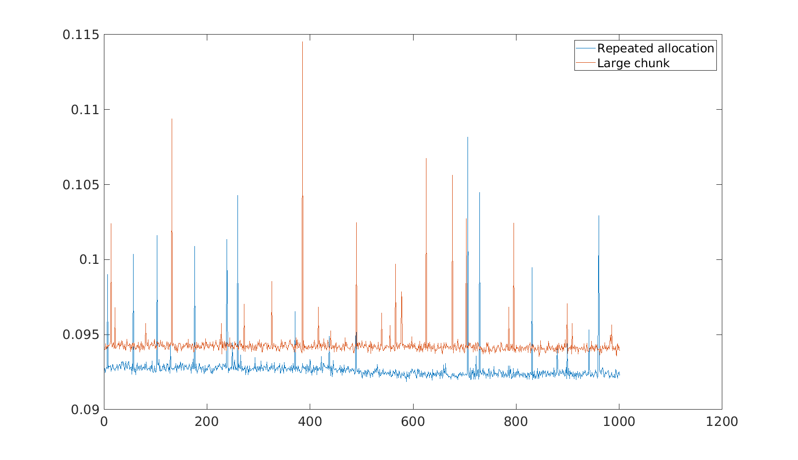

# QSFDI

1. [Observations so far [2022-05-26]](#log_wbqml01_v0003_1)
1. [QSFDI applied for pressure smoothing [2022-05-27]](#log_wbqml01_v0003_2)
1. [OMP Local allocation of large matrix vs passing them as argument [2022-05-31]](#log_wbqml01_v0003_4)
1. [List of function for applying QSFDI [2022-05-30]](#log_wbqml01_v0003_3)
1. [Test sequence [2022-05-31]](#log_wbqml01_v0003_5)

## Attempting
Implement QSFDI wherever possible

## List of Work
- [ ] PRESSURE_SMOOTH: If QSFDI fails for a node, the switch to MLS. If MLS fails it will do Shephard fnc.
- [ ] interp_IQSFDI_shapeFun_3D_Wei: 
	- [x] Parallel compatible. Used OMP REDUCTION. Important speedup
	- [ ] Remove local allocations [link](#log_wbqml01_v0003_4)

-----------------------------------------------

## Test sequence [2022-05-31]

| Test | Step | Function | Remark |
| ---- | ---- | -------- | ------ |
| T01  | 2.5  | PRESSURE_SMOOTH |  MLS default for bnd and NWID3EQ9 |
| T11  | 3  | GRADIENT_POM |   |
| T12  | 3  | T01 + T12 |   |

### Test T01

| Step | Function | Description | Present | Old | Do-QFSDI? | Tested |
| --- | -------- | ----------- | ------- | --- | --------- | ------ |
| 2.5 | PRESSURE_SMOOTH | Smoothen pressure | MLS / SFDI /QSFDI |   | Yes - Done | EmpT |

### Test T11

| Step | Function | Description | Present | Old | Do-QFSDI? | Tested |
| --- | -------- | ----------- | ------- | --- | --------- | ------ |
| 3   | GRADIENT_POM | gradP | SFDI |   | Yes - High |   |

### Test T21

| Step | Function | Description | Present | Old | Do-QFSDI? | Tested |
| --- | -------- | ----------- | ------- | --- | --------- | ------ |
| 2   | ASSEMATRIX_MLPG_SHA | gradPhi  | SFDI |  | Yes - High |   |

-----------------------------------------------

## List of function for applying QSFDI [2022-05-30]

Step-1: Intermediate velocity calculation  
Step-2: Pressure Poisson equation  
Step-3: Velocity correction step

| Step | Function | Description | Present | Old | Do-QFSDI? | Tested |
| --- | -------- | ----------- | ------- | --- | --------- | ------ |
| 1   | LAPLACIAN | Laplacian of vel for viscosity |   |   |  Yes-Low |   | 
| 2   | ASSEMATRIX_MLPG_SHA | NWID3EQ9 Extrapolation | MLS |   |  No |   | 
| 2   | ASSEMATRIX_MLPG_SHA | gradPhi  | SFDI |  | Yes - High |   |
| 2   | FILL_MATRIX_SHA | LHS | MLS / SFDI |   |  Maybe - Low |   |
| 2   | FILL_MATRIX_SHA | LHS | MLS / SFDI |   |  Maybe - Low |   |
| 2   | FILL_MATRIX_SHA | NWID3WQ9 Extrapolation | MLS |   | No |   |
| 2.5 | GHOSTPART | Mirror Pressure | MLS |   | Maybe - High |   |
| 2.5# | PRESSURE_SMOOTH | Smoothen pressure | MLS / SFDI / QSFDI |   | Yes - Done | EmpT - NoChange   Cyl - NotTested |
| 3#   | GRADIENT_POM | gradP | SFDI / QSFDI |   | Yes - High | EmpT - NotTested   Cyl - NotTested |
| 3   | GRADIENT_PCYL | gradP at Cyl nodes | SFDI |   | Yes - High |    |
| 3   | GRADIENT_2P | gradP at wall | SFDI |   | Yes - High |    |
| 3.5 | GHOSTPART_V | Mirror Velocity | MLS |   | Maybe - High |   |
| 3.5 | VELOCITY_SMOOTH_SHA | Velocity smooth | MLS |   | Yes - Med |   |
| 4   | MLPG_GET_ETA | Interpolate ETA for probes and remeshing | MLS |   | Yes - low |
| 4   | MLPG_GET_UP2 | Interpolate ETA for probes and remeshing | MLS |   | Yes - low |

-----------------------------------------------

## OMP Local allocation of large matrix vs passing them as argument [2022-05-31]

- DRYAN in his QSFDI function allocated many matrices to the size of NN, where NN is the number of neighs

- I usually follow the practice of instead allocating a chunk of size NLMAX and passing all these temp matrices as an argument in the function

- I tested the two to see which is faster

- For local allocation within the function, OMP will make separate copies for each thread so thats not a problem

- It appears repeated allocation and deallocation is faster than passing large chunk NLMAX (surprised)
	- This practice is definitely more convenient. But I didnt think it'll be faster.

Trials:

Repeated allocation  
Test_yansfdi_caseS1a_both/bqmlQSFD_Y02_caseS1a_dx050_dt008_L35_L1p50R1p50_Walt_algoTest

Large chunk  
Test_yansfdi_caseS1a_both/bqmlQSFD_Y03_caseS1a_dx050_dt008_L35_L1p50R1p50_Walt_algoTest

-----------------------------------------------

## QSFDI applied for pressure smoothing [2022-05-27]

- The trials with DRYAN_SFDI for pressure smoothing had failed.
	- Likely due to the large error in interpolation of SFDI, verified by a single point test

- The single point test for DRYAN_QSFDI revealed an excellent interpolation, given sufficiently large support domain.

- So I applied DRYAN_QSFDI to pressure smoothing. It worked very well.   Results: `Test_yansfdi_caseS1a_both/bqml71SFD_caseS1a_dx050_dt008_L35_L1p50R1p50_Walt_Long`
	- Note: It was applied only to fluid particles
	- Note: MLS was applied to NWID3EQ9 and wall particles.
	- Ran it for the Bsnq-cpled case with L1.50R1.50
	- It failed after 8900+ time-steps. (My earlier runs with my SFDI had failed after 8600+ time-steps)
		- The reason is particle concentration in the relaxation zone.

- Issue of determinant = 0 still persists.
	- I noticed that at times the errState=3 was reported out the the QSFDI function
	- The determinant was going =0 mostly at wall edges with poor particle distribution.
	- Can likely address this by increasing the radius.
	- It is a bug state that should be resolved, possibly by doing MLS for the nodes where this fails or maybe increasing the radius by a little bit un-till it works.

-----------------------------------------------

## Observations so far [2022-05-26]

The SFDI implementation by me and DRYAN are quite different

- Radius in weiFnc: If calculation is being done for INOD
	- DRYAN: Radius in weiFnc = R(INOD).   The concept that the domain of dependece is a user specified sphere.
	- Me: Radius in weiFnc = (R(NEI) + R(INOD)) / 2.   The concept that the domain of dependence of the location is a sum of domain of influence of the neighbours.

- Some other difference. I have followed the Ma (2008) paper exactly. DRYAN has not done that way.

- **My SFDI implementation works very well for the smoothing of pressure. DRYAN SFDI does not work well for smoothing of pressure.**

- While doing calculation at INOD, DRYAN excludes the INOD for SFDI and QSFDI in the list of neighbours.   I include INOD in neighbour list always.

General guidelines about DRYAN library of SFDI, QSFDI

- Support domain is a sphere of user specified radius around the point of calculation. Hence the radius in the weiFnc = R(INOD)

- While doing calculation at INOD, DRYAN excludes the INOD for SFDI and QSFDI in the list of neighbours.   If you include INOD in list of neighs then the function will return the shp with value 1 for INOD and 0 for rest all.

- Interpolation by SFDI was quite poor actually. Interpolation by QSFDI seems very good. Comment based on interpolation at a single point.
	- Due to this the interpolation of pressure by YAN_SFDI kept breaking down soon after like 2500 steps. (Trying with QSFDI to see if its gonna be better)

## References
1. Ma, Q.W., 2008. A new meshless interpolation scheme for MLPG_R method. CMES - Computer Modeling in Engineering and Sciences 23, 75–89. https://doi.org/10.3970/cmes.2008.023.075

-----------------------------------------------

# References
