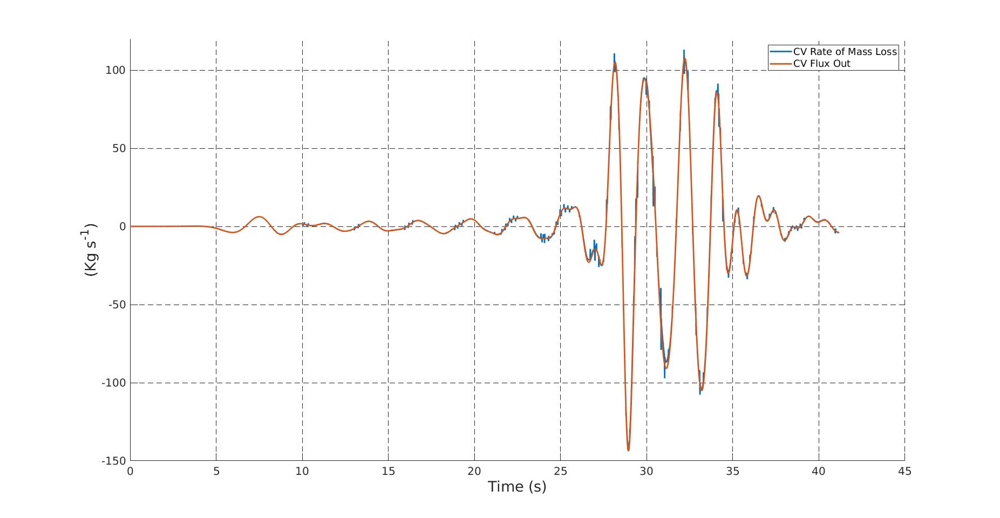
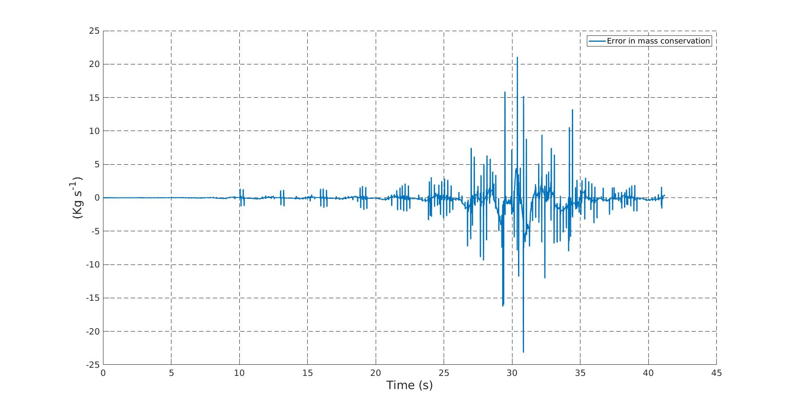
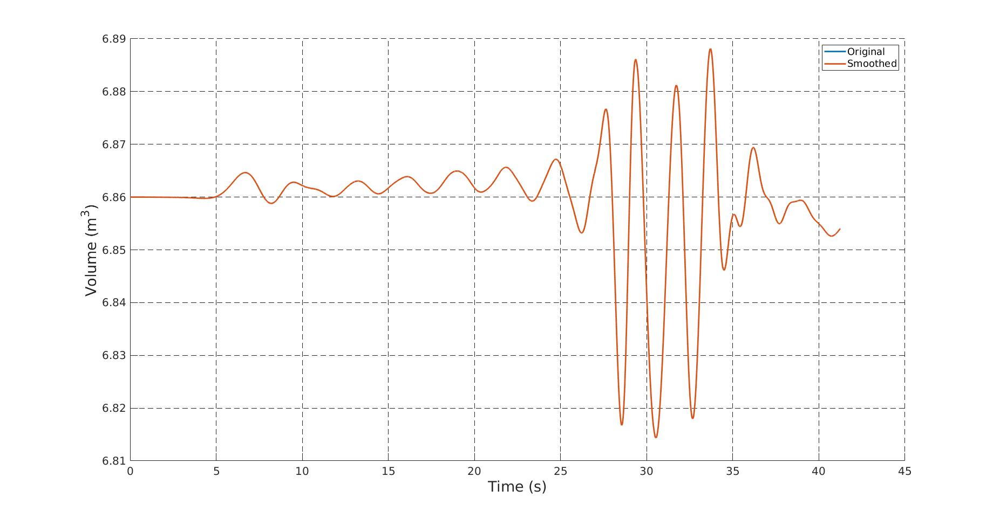
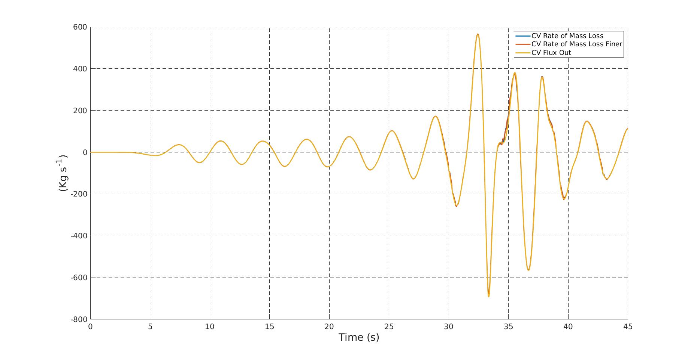
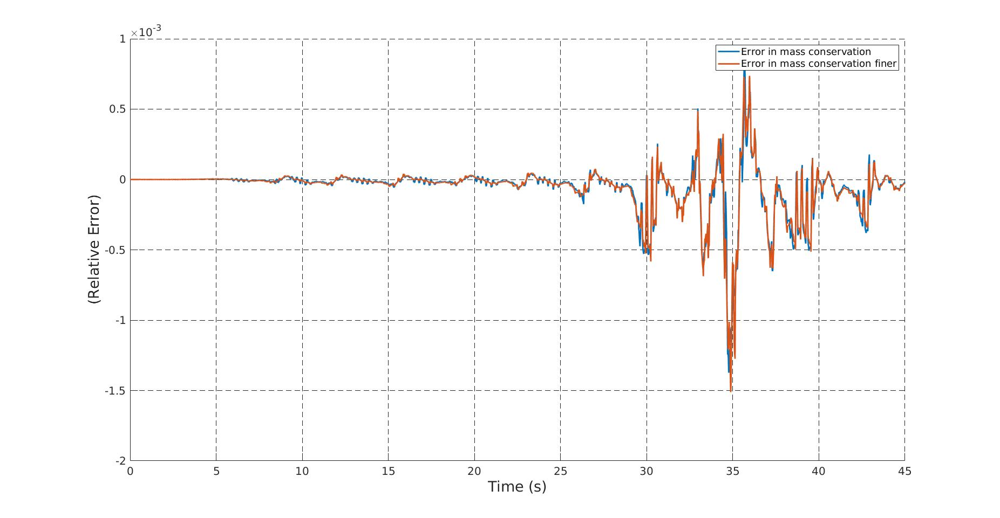
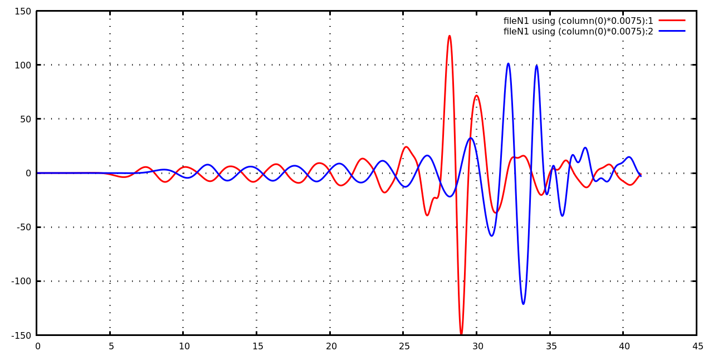

# Depth Integrated Velocity

1. [Edited _MLPG_GET_ETA()_ to avoid repeated allocations [2020-07-11]](#log_mlpgrv01_v0003_1)
1. [Edited _FILLCELL()_ to avoid repeated allocations [2020-07-12]](#log_mlpgrv01_v0003_2)
1. [Mass flux through vertical plane using FLUXPLANEMOD [2020-07-16]](#log_mlpgrv01_v0003_4)
1. [Mass conservation check [2020-07-17]](#log_mlpgrv01_v0003_5)
1. [Write and read resume file [2020-08-08]](#log_mlpgrv01_v0003_6)

## Attempting
- Calculate mass and momentum flux
- Calculate depth integrated velocities

## List of Work
- [x] Mass flux
- [ ] Momentum flux
- [ ] Depth-integrated velocity
- [ ] Weight function for coupling
- [x] Mistake in JUDGEFREE_SURFACE regarding the hard-coded water depth not too significant though. (corrected by commenting the statement) [2020-08-08]
-----------------------------------------------

## Mass conservation check [2020-07-17]
- Created a module VOLPLANEMOD to generate a XY rectangular plane with regularly spaced nodes on which free-surface will be interpolated to calculate volume under the free surface.
- _SETVOLPLANE()_ generates NX and NY number of nodes at regular intervals between XY points BL (bottom-left) and TR (top-right).
- Again it is ensured that NX and NY >3 and odd for Simpson's 3 point integration.
- Next is the subroutine _CALC_VOL()_, which calculates the volume under the FS
    - The subroutine _MLPG_GET_ETA()_ is used to get the free-surface level at the XY points of VOLPL
    - If the free-surface is not available at any of the XY nodes (such as for a point inside the cylinder) then the Z value of free-surface is taken as ZCORR which is given by the user (here taken as still water level)
        - For mass conservation we are interested in d(mass) / dt, so this extra volume should not create a problem.

The volume for VOLPL and flux in and out from FLUXIN FLUXOT are then output at the end of each time-step in mlpgTerOut.rout.

The conservation of mass is checked using  
-d(mass)/dt = -fluxIn + fluxOt

Here the d(mass)/dt is calculated in post using a Matlab code with the values of volume using central difference for the time-derivative.

### Test 1
- Tested for case isopeCyl_23001 with cylinder.
- Remesh = 30. dt = 0.0075. Mesh = 0.043
- Flux-in placed at 3m and flux-out at 10m with cylinder at 6.5m.
- Flux-in: (red)
    - BL = (  3, 0.0, 0.0 )
    - TR = (  3, 1.4, 0.7 )
- Flux-out: (blue)
    - BL = ( 10, 1.4, 0.0 )
    - TR = ( 10, 0.0, 0.7 )
- VOLPL = (  3, 1.4 ) to  ( 10, 0.0 )

|       |
| ----- |
| **Figure :** Rate of mass loss = - d(mass)/dt (4 point central diff). Flux Out = -flxIn + flxOt. |
|  |
| **Figure :** Error in mass conservation = d(mass)/dt -fluxIn + fluxOt |
|  |
| **Figure :** Volume in the CV |
|  |

Observations :

- The overlap is decent.
- The spikes in error are due to the spikes in the Rate of Mass loss d(mass)/dt.
- I thought that the spikes were due to remeshing.
- But that alone is not the reason as shown in the Volume plot.
	- The rate of mass loss was calculated for the original and smoothed plot. There smoothed volume plot did not result in a significantly smoother rate of mass loss.
- Another possible problem is that the point for volume calculation will miss out in the small volumes of water around the cylinder as the cylinder shape will not be captured.
- I should probably try to run two volume-planes with two different spacing to check if it helps.

### Test 2
- Test case is T2M2 as reported in the (attempted) JCP paper.
	- f23003o2
	- Mesh = 0.0625m
	- dt = 0.01s
	- remesh = 30
- Flux-in: 
    - BL = (  4, 0.000, 0.0 )
    - TR = (  4, 1.625, 1.0 )
- Flux-out: 
    - BL = ( 10, 1.625, 0.0 )
    - TR = ( 10, 0.000, 1.0 )
- VOLPL = (  4, 1.625 ) to  ( 10, 0.000 )
- Here too the noise in the error is seen but it doesn't seem to be related to the remeshing mostly
- The noise is not too much in the Rate of Mass loss plot, unlike Test 1.
- Here I have non-dimensionalised the error in conservation of mass using the formula  
_Error non-dimensional = Error / ( CV_Len * CV_Width * dep * sqrt(g/dep) )_ 
where _dep_ is the initial water level in the CV(control volume)

|       |
| ----- |
| **Figure :** Rate of mass loss = - d(mass)/dt. Flux Out = -flxIn + flxOt. 'finer' implies 2x number of point on the volume plane for volume calc |
|  |
| **Figure :** Error in mass conservation = d(mass)/dt -fluxIn + fluxOt |
|  |

-----------------------------------------------

## Mass flux through vertical plane using FLUXPLANEMOD [2020-07-16]
- Created FLUXPLANEMOD in 'modules_v3.1.f90'
- The plane is assumed to be vertical, but can have any orientation in the XY plane.
- It is initialised by points BL (bottom left) and TR (top right).
    - The outward unit normal is calculated automatically.
    - Describe the BL and TR such that you are looking out of the plane to get the correct normal.
- NXY is number of equally spaced point along the XY for the vertical plane.
- NZ is the number of equally spaced points between z coord of BL and the free-surface elevation at a particular XY node.
- NXY and NZ are corrected to be odd and greater than 3 for Simpson's 3 point integration.
- XFS YFS ZFS are points on the free-surface of this plane
- X Y Z are then generated if the full FS of the plane is known
    - These are all the points along the depth under the plane's free-surface.
- A new ERROR variable is introduced in _MLPG_GET_ETA()_. 
    - This variable is 0 is eta is available at that XY location
    - This variable is 1 and Eta out = 0 if Eta is unavailable at this XY location
    - If ERR = 1 on any of the plane's XFS,YFS then we do not calculate the mass flux for the plane.
- In the next commit another input variable PRINTERRMSG is added to _MLPG_GET_ETA()_
    - PRINTERRMSG = 0 : Doesn't print the error messages due to lack of neighbours or the determinant of A in MLS being 0.
        - It is useful in cases such as volume calculation where we know there may be nodes (such as inside the cyinder) where eta is unavailable.
- Mass flux across the plane is given by &#x222b; &rho; (V . n) dS
- Not verified

Additionally the implementation required two new subroutines in the base code too.

- _MLPG_GET_UP2()_ is for obtaining velocities and pressure at any point (x,y,z) using the MLPG domain, with the information of NODEID and NWALLID known.
    - If NODEID is -ve to >10 then the MLPG point is not taken for interpolation
    - If NWALLID(i,2) = -2 then the point is not taken for interpolation
    - The above two are done in new subroutine _WEIGHTF4()_
- The earlier function _MLPG_GET_UP()_ was not using the NODEID and NWALLID variables
    - This subroutine was used in the remeshing where the process of filtering out unused nodes already happen before calling the function.
- In order to use NODEID and NWALLID the existing _WEIGHTF3()_ were not sufficient so _WEIGHTF4()_ was written.

### Test 1
- Tested for case isopeCyl_23001 with cylinder.
- Flux-in placed at 3m and flux-out at 10m with cylinder at 6.5m.
- Flux-in: (red)
    - BL = (3, 0,   0  )
    - TR = (3, 1.4, 0.7)
- Flux-out: (blue)
    - BL = (10, 1.4, 0  )
    - TR = (10, 0,   0.7)

-----------------------------------------------

## Edited _FILLCELL()_ to avoid repeated allocations [2020-07-12]
- Located as a part of the module NODELINKMOD inside the file 'nodelinkNew_v2.3.f90'
- The function _FILLCELL()_ is allocating and deallocating RCX, RCY, RCZ.
- This function is called once every time-step for variable MLDOM, and that involves a large number of nodes.
- Therefore removing this allocation as its totally unnecessary.
- Also corrected the following mistake.
    - Wrong : `IX=FLOOR((THIS%REFBL(1)-THIS%REFTR(1))/THIS%CELLR)`
    - Corrected : `IX=FLOOR( (THIS%REFTR(1)-THIS%REFBL(1)) / THIS%CELLR )` 
- Also tested that OMP in _FILLCELL()_ loop actually makes it slower because of the need for `!$OMP CRITICAL`.

-----------------------------------------------

## Edited _MLPG_GET_ETA()_ to avoid repeated allocations [2020-07-11]
- This subroutine is to get wave elevation at random XY through interpolation using MLS.
- I had written all of my subroutines as 3D
- Therefore to call the _WEIGHTF3_SHA()_ and _SHAPPARA_R_SHA()_, I had to allocated a temporary variable ZTMP at every instance of _MLPG_GET_ETA()_ function call.
- This was not a big issue for wave probes, or even for remeshing, because either they were too few nodes, or they were called very few times.
- However for coupling with BSNQ, I will have to call this subroutine at every time-step and it might involve a large number of BSNQ nodes.
    - Therefore the repeated allocation and de-allocation of ZTMP would have been an issue.
- So I have introduced the following two subroutines to get rid of ZTMP
    - _SHAPPARA_R_2D_SHA()_ 
        - Located inside 'interpNew_v1.5.f90'
        - Works for any 2D plane, identified using PLANEID
        - 1 = XY PLANE. Z=0.   COOR1=X. COOR2=Y
        - 2 = YZ PLANE. X=0.   COOR1=Y. COOR2=Z
        - 3 = XZ PLANE. Y=0.   COOR1=X. COOR2=Z
    - _WEIGHTF3_XY_SHA()_
        - Located inside 'interpFnc_v1.5.f90'
        - Works for XY plane only
        - Meant only for free-surface domain, for which Z=0 by default in the FSDOM object.

-----------------------------------------------
