# Sloping bottom [2021-04-09]

1. [Functions that use H0 [2021-04-09]](#log_mlpgrv01_v0004_1)
2. [Making bottom boundary points stationary [2021-04-15]](#log_mlpgrv01_v0004_2)
3. [Full stationary bottom approach didnt work [2021-09-03]](#log_mlpgrv01_v0004_3)

## Attempting
- Sloping bottom

## List of Work
- [x] mlpgrMain.f90: Replace storing bnd in BNDFIX using node-edge-type
- [x] Remove WMA and WMV entirely
	- Removed WMV from _U_BOUNDARY()_
- [ ] NWALLID(,2)=-11 for top nodes of near and far side walls assigned in CYLINDs. Wont work in breaking cases.
- [ ] See if BNDFS is even required. (So far applied only to near and far sidewalls)

-----------------------------------------------

<a name = 'log_mlpgrv01_v0004_3' />

## Full stationary bottom approach didnt work [2021-09-03]
I had tried to make a full bottom approach as it will be easier to do sloping bottom using that approach.

| Bottom view. Yellow are bottom type2 nodes.      |
| ----- |
| **Figure :** Old version : Bottom nodes inner only |
| 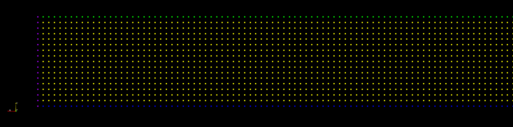 |
| **Figure :** New version : Bottom nodes full |
| 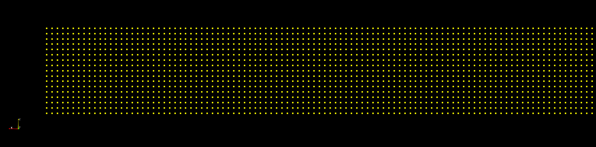 |

Initial results were all fine as seen in [link](#log_mlpgrv01_v0004_2). 

However on doing a longer test I found an important issue. There seemed to be a rise in wave amplitude over time for a regular wave as shown below.

| mlpgO = Old version, mlpg = New version  |
| ----- |
| **Figure :** x=21m |
| 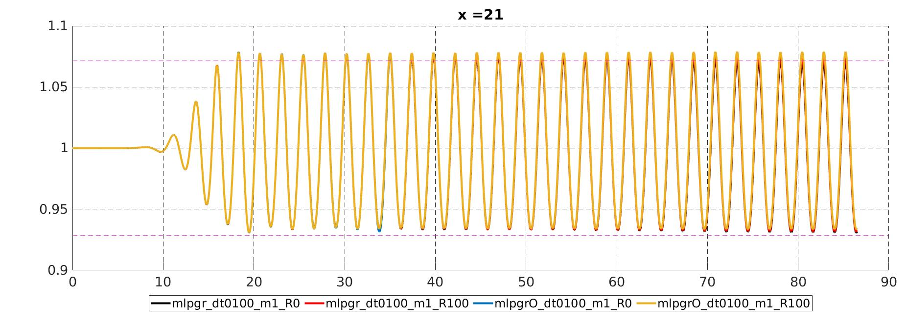 |
| **Figure :** x=70m |
| 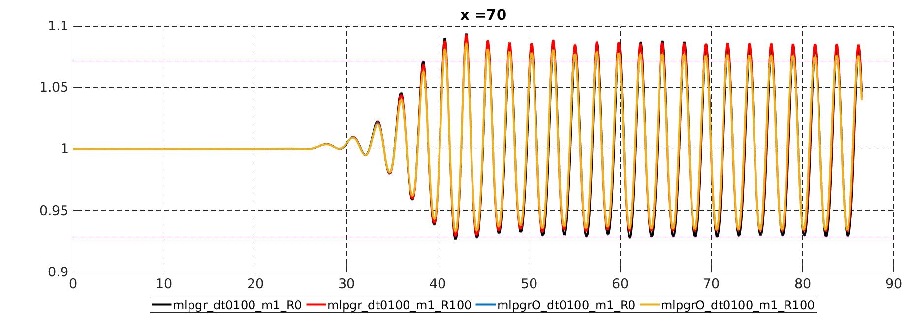 |

- That increase is possibly due to the bottom layer of side walls being shifted from the side wall nodes to type2 nodes and hence were not included in the GRADIENT_2P subroutine.
- Anyway for now I am shifting to the old form and continuing development there.

-----------------------------------------------

<a name = 'log_mlpgrv01_v0004_2' />

## Making bottom boundary points stationary [2021-04-15]

### List of Work
- [ ] Remove BNDFIX unnecessary parts
- [x] Remesh code

### Things done
- fnptCoupling.f90:
	- In _SETCOUPLING()_, removed the bottom type2 nodes from the coupling weight function, as the tationary boundary nodes are no longer compatible with this algorithm
	- Will continue using the MLPG pressure for these bottom nodes which lie in the FNPT-MLPG coupling region
- Fixing the bottom nodes and extending the bottom plane to all edges removes the tedious regridding that we used to do for the bottom nodes and the bottom layers of the side walls.

### Wet-dry bottom (type2) nodes
- Fixing of bottom nodes requires identification of wet and dry nodes.
- This is done for each bottom node _Bi_ by finding the closest non type2 node, _nodeClosest_.
- If _nodeClosest_ is within DDR then then _Bi_ is wet otherwise its dry.
- After this we also check the interface type2 nodes, which are any type2 nodes with dry type2 neighs within DDR distance
	- Remember DDR is (SCALE+COEF)\*(avg of closest 6 nodes) \~= 1.8\*DDL
	- These interface nodes are made `NWALLID(I,3)=9` to make their pressure calc as MLS extrapolation.
	- **This interface plays a major role in solution stability, though is not exactly essential**
	- [Link](#log_mlpgrv01_v0004_2d) to the issue.

### No Slip Bottom

- After fixing the bottom nodes, I initially implemented zero velocity (u,v,w=0) for all bottom type2 nodes
- However due to this we had a major dissipation of the waves as seen in the images below
	- This is due to improper capturing of the bottom boundary layer 
	- It will happen unless u use a very fine mesh in the bottom to properly capture the boundary layer
- Therefore for our problems we should have slip BC for bottom.

	
Wave probe results

<table style="width:100%">
  <tr><th>Old MLPG (purple) vs noSlip Bottom Stationary (green)</th></tr>
  <tr><td><b>Fig: x = 1.00m<\b></td></tr>
  <tr><td>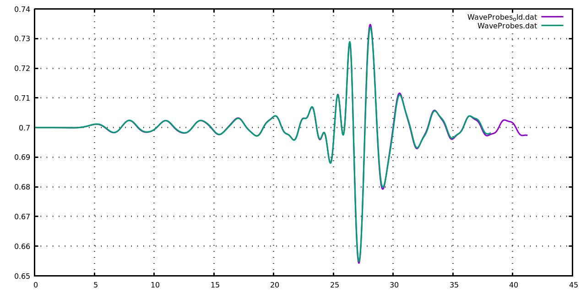 </td></tr>
  <tr><td><b>Fig: x = 5.93m<\b></td></tr>
  <tr><td>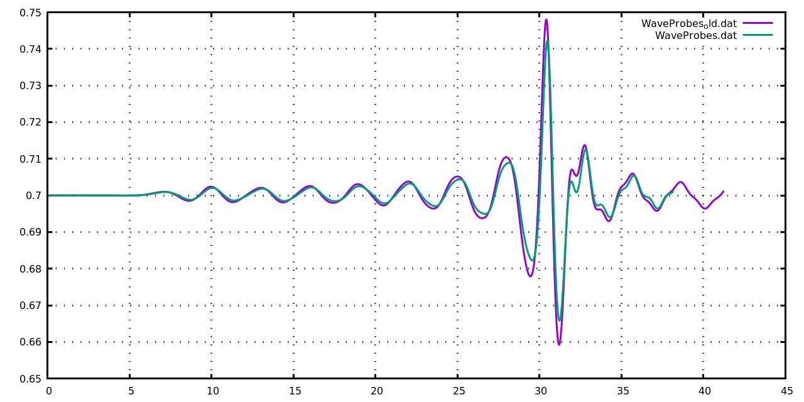 </td></tr>
  <tr><td><b>Fig: x = 6.50m<\b></td></tr>
  <tr><td>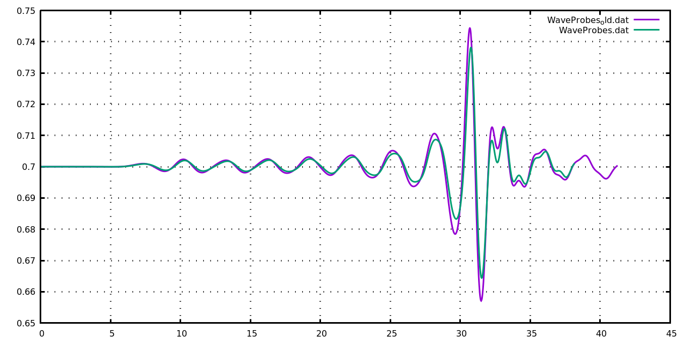 </td></tr>
  <tr><td><b>Fig: x = 7.20m<\b></td></tr>
  <tr><td>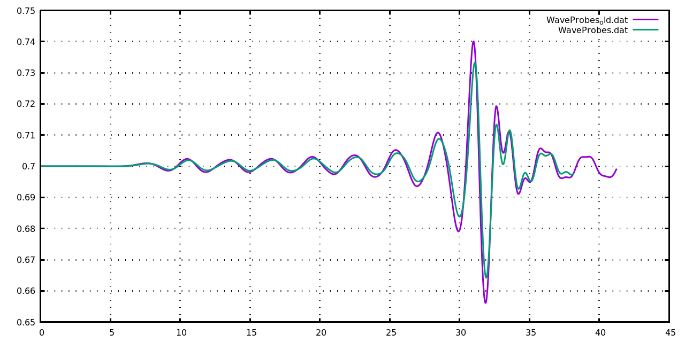 </td></tr>
  <tr><td><b>Fig: x = 5.00m<\b></td></tr>
  <tr><td>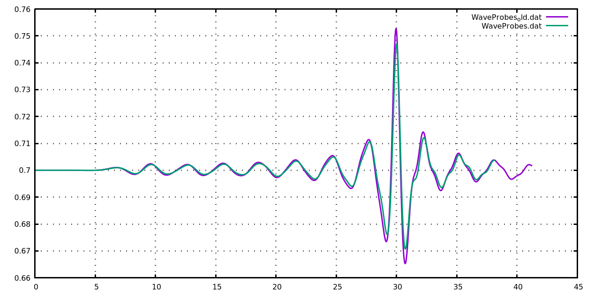 </td></tr>
  <tr><td><b>Fig: x = 6.00m<\b></td></tr>
  <tr><td>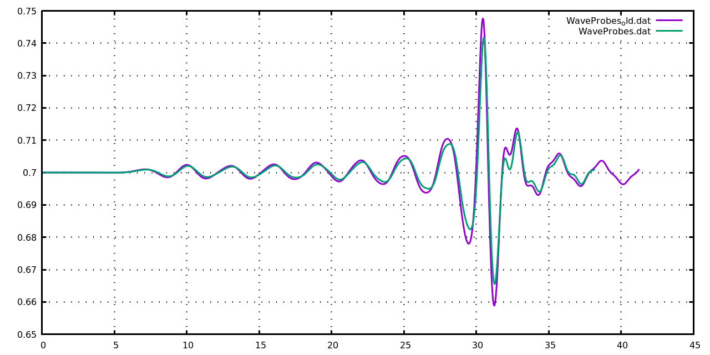 </td></tr>
  <tr><td><b>Fig: x = 7.00m<\b></td></tr>
  <tr><td>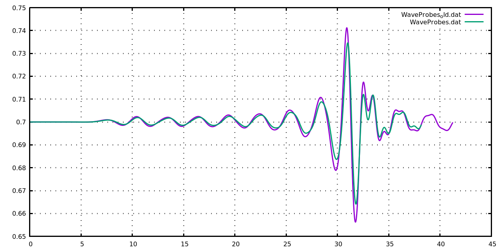 </td></tr>
  <tr><td><b>Fig: x = 8.00m<\b></td></tr>
  <tr><td>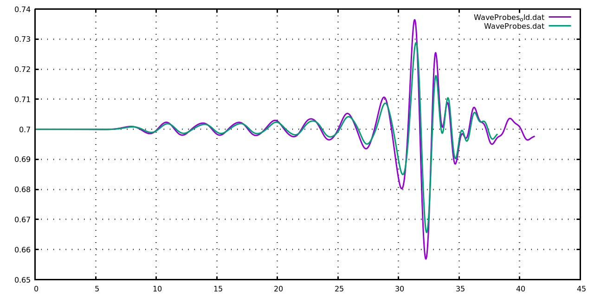 </td></tr>
  <tr><td><b>Fig: x = 9.00m<\b></td></tr>  
  <tr><td>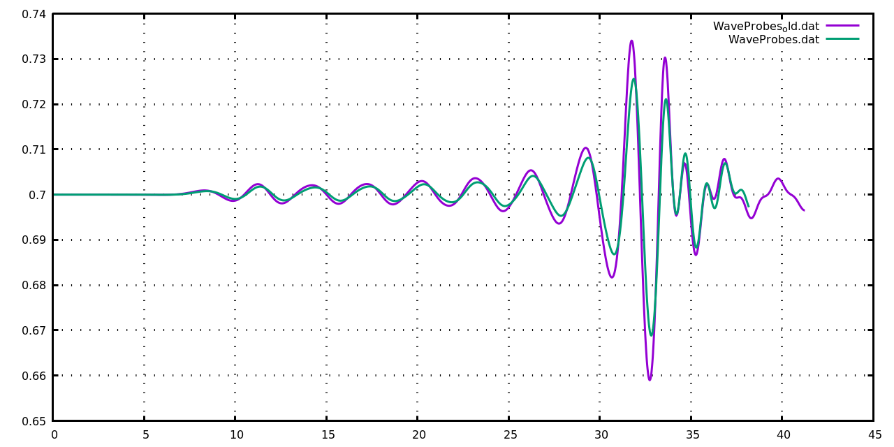 </td></tr>
</table>

### Slip Bottom
- Added a subroutine _BOTSLIPBC()_ to implement slip BC for type2 nodes
- This is done by finding the closest non type2 node and putting that node's vel to the type2 node.
- We remove the component of the vel which is normal to the type2 node
- This is done after the movement of the coordinates in _UPDATE_CO_. This way the vel obtained on the type2 node is essentially updated in time.
- Now the results match almost identical to the old code, with no remeshing.
- **Note:** Ideally I should interpolate the vel, but thats gonna have some dissipation for sure.
	- Alternatively I can use the current method of assigning the vel on type2 node using the closest non type2 nodes vel. And after this interpolate the vel on the type2 nodes using all its neighbours.

	
Wave probe results

<table style="width:100%">
  <tr><th>Old MLPG remesh0 (purple)   vs   Slip Bottom Stationary with interface type2 nodes and no motion in Y axis of oppWM (type3) nodes remesh0 (green)</th></tr>
  <tr><td><b>Fig: x = 1.00m<\b></td></tr>
  <tr><td>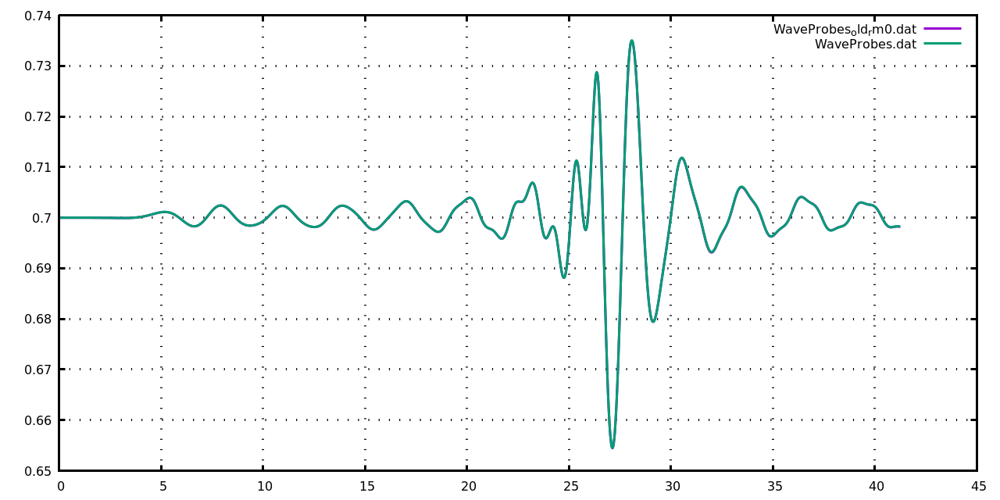 </td></tr>
  <tr><td><b>Fig: x = 5.93m<\b></td></tr>
  <tr><td>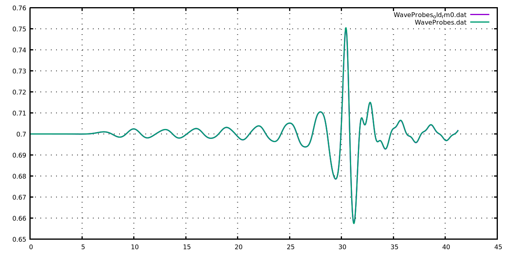 </td></tr>
  <tr><td><b>Fig: x = 6.50m<\b></td></tr>
  <tr><td>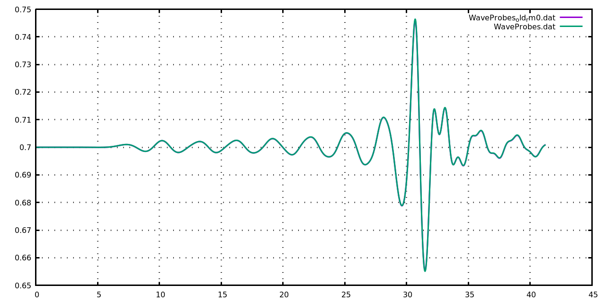 </td></tr>
  <tr><td><b>Fig: x = 7.20m<\b></td></tr>
  <tr><td>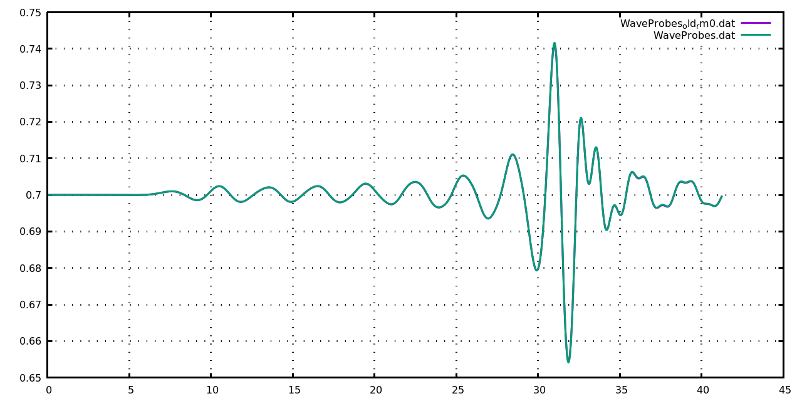 </td></tr>
  <tr><td><b>Fig: x = 5.00m<\b></td></tr>
  <tr><td> </td></tr>
  <tr><td><b>Fig: x = 6.00m<\b></td></tr>
  <tr><td>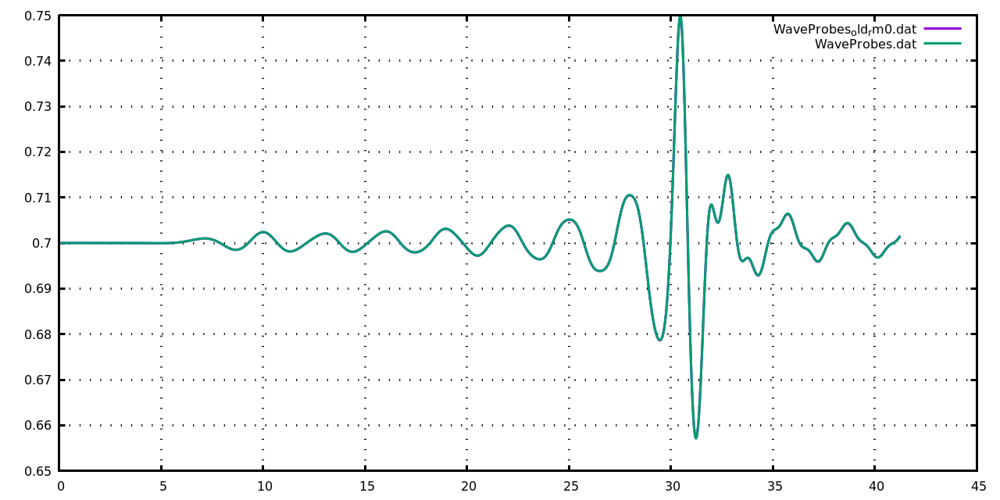 </td></tr>
  <tr><td><b>Fig: x = 7.00m<\b></td></tr>
  <tr><td>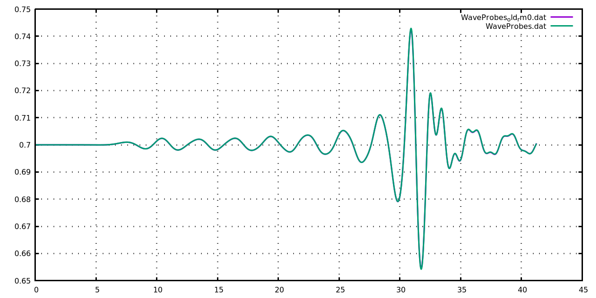 </td></tr>
  <tr><td><b>Fig: x = 8.00m<\b></td></tr>
  <tr><td>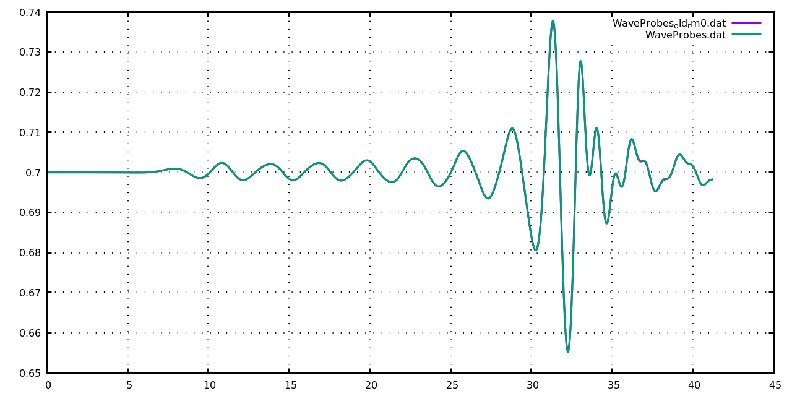 </td></tr>
  <tr><td><b>Fig: x = 9.00m<\b></td></tr>  
  <tr><td>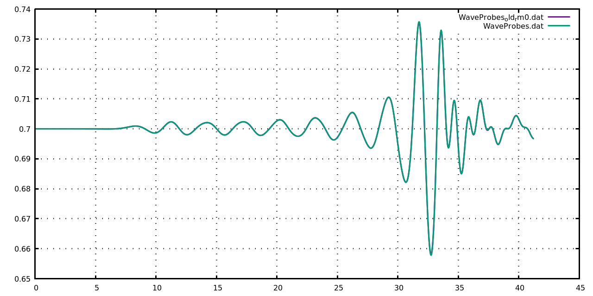 </td></tr>
</table>

<a name = 'log_mlpgrv01_v0004_2d' > - </a>

### Leakage at top right back corner

There was a mistake made long ago in functions such as _FIXCYLINDER()_ where I had by mistake done looping from `NODEID(-7), NODIEID(-1)` instead of `NODEID(-7)+1, NODIEID(-1)`. Due to this a far side-wall particle at the top right corner was being made stationary and caused issues.  
This was resolved in this function and other places with NODEID(-1) (though the other places were largely harmless.) 
Discussed in detail in 
[link](./log_mlpgrv01_vBugs.md#log_mlpgrv01_vBugs_2)

-----------------------------------------------

<a name = 'log_mlpgrv01_v0004_1' />

## Functions that use H0 [2021-04-09]

| SN  | Function | Purpose |
| --- | -------- | ------- |
|  1 | GIVENINITIALV_P() | Initial static pressure is assigned |
|  2 | mlpgrMain.f90 | Just before and after _PRESSURE_SOLVER2()_ |
|  3 | fnptCoupling.f90 READFNPT | To change z ref from MSL to bottom |

-----------------------------------------------

## References
1. Kamath, A., Alagan Chella, M., Bihs, H., & Arntsen, Ø. A. (2017). Energy transfer due to shoaling and decomposition of breaking and non-breaking waves over a submerged bar. Engineering Applications of Computational Fluid Mechanics, 11(1), 450–466. [link](https://doi.org/10.1080/19942060.2017.1310671)