# Coupling in 3D [2021-09-29]

1. [Open BC one-way coupling left face [2021-09-08]](#log_mlpgrv01_v0005_1)
1. [Observations on various weak coupling approaches [2021-09-29]](#log_mlpgrv01_v0005_2)

## Attempting
- 3D wave input from FNPT or Stokes2 or potentially Bsnq

## List of Work

-----------------------------------------------

<a name = 'log_mlpgrv01_v0005_2' />

## Observations on various weak coupling approaches [2021-09-29]

There are 4 coupling strategies that I can list down for discussion

| Coupling Methods |
| ----- |
| **Figure : Method-1 : Moving Overlap + Node weight fixed over time** |
| 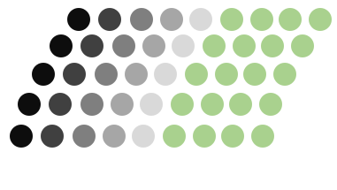 |
| Shagun (2021) Computers and Fluids |
|  |
| **Figure : Method-2 : Moving overlap + Node weights change every time-step** |
| 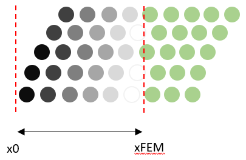 |
| Sriram (2014) Journal of Computational Physics |
|  |
| **Figure : Method-3 : Fixed overlap zone + Node weights change every time-step** |
| 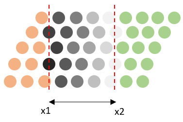 |
|  |
|  |
| **Figure : Method-4 : Feeder particle No overlap** |
| 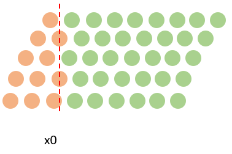 |
| Ni (2018) Ocean Engineering |
|  |

- I have modified the code such that I can use Method-1 and Method-3. The details are in [log0005_v1](#log_mlpgrv01_v0005_1)
- Method-1 worked very well for us in solitary, regular and focusing wave cases. However it might be tricky to handle in 3D because of the moving overlapping region. The difficulties may arise while trying to remesh. But still is doable.
- Method-2 VSR has implemented in his 2D strongly coupled code.
- Method-4 is the one use in various SPH paper as inlet BC. It does not use any overlapping zone which is quite strange.

I tested the following regular wave case. It was scaled to 1m water depth This was done in the Shagun (2021) Computers and Fluids paper

| SN  | Regime | h/(gT^2) | H/(gT^2) | h   (m) | T   (s)| H   (m) | L   (m) | kh | ka | Remarks |
| --- | ----- | ----- | ----- | ----- | ----- | ----- | ----- | ----- | ----- | ----- |
| Reg1 | Stokes2 | 1.7839 e-2 | 2.548 e-3 | 0.70 | 2.0000 | 0.1000 | 4.6236 | 0.9512 | 6.7946 e-2 | Used in CnF Paper |
| Reg1sc | Stokes2 | 1.7839 e-2 | 2.548 e-3 | 1.00 | 2.3904 | 0.1428 | 6.6051 | 0.9512 | 6.7946 e-2 | Scaled version of the above |
| Reg2 | Stokes2 | 2.5484 e-2 | 0.5097 e-3 | 1.00 | 2.0000 | 0.0200 | 5.2154 | 1.2047 | 1.2047 e-2 | Smaller amplitude |

### Method-4 : Reg1sc results

- No remeshing
- I dont expect this to work from previous exp. The same is observed here.
- Particles collide at the top and simulation fails
- In WCSPH, the increase in the density at the top might be driving the flow.
- However the same is not observed in my results probably coz we are using incompressible formulation.

|  |
| ----- |
| CaseName : regBF4_d0p7_T2p0_H0p10_scd1p0_dr050_dt0100_fed0p20 |
| 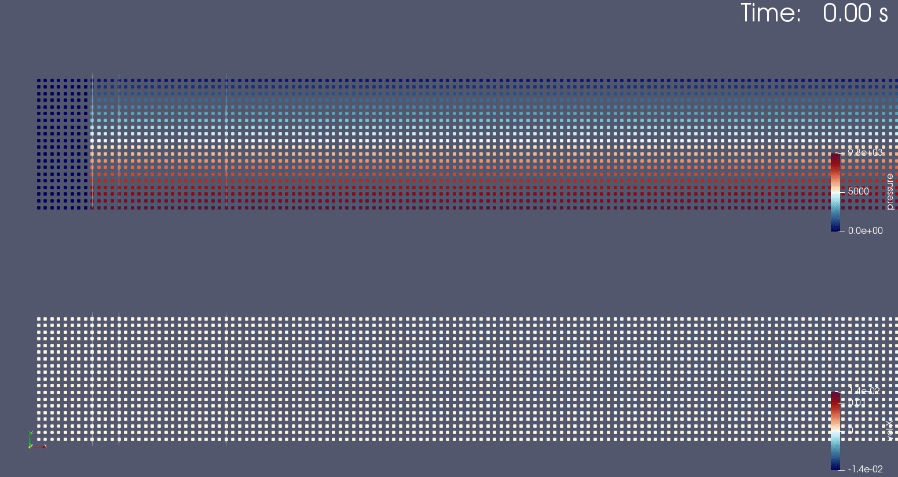 |

### Method-3 : Solitary

- No remeshing
- Tested this with solitary wave first. Worked fine.
- I kept too small a feeder particle zone here but I guess was ok for this wave.
- The difference in relaxation zone may be due to the corrections made on the right boundary region.

|  |
| ----- |
| CaseName : solBF3_d1p0_H0p10_dr050_dt0100_rlx1p00 |
| 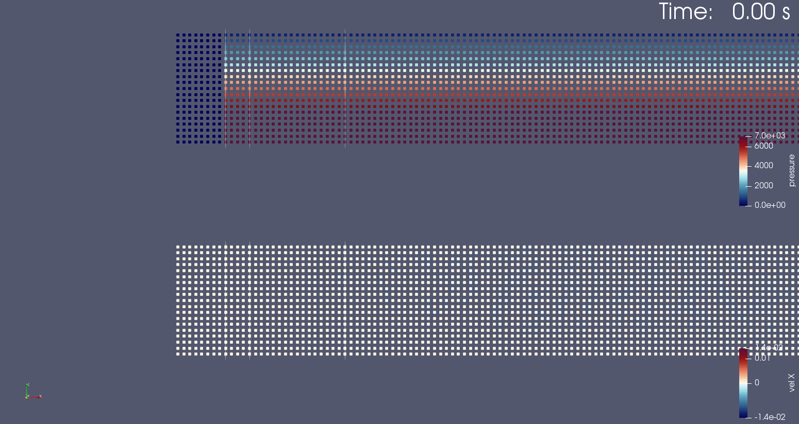 |
| 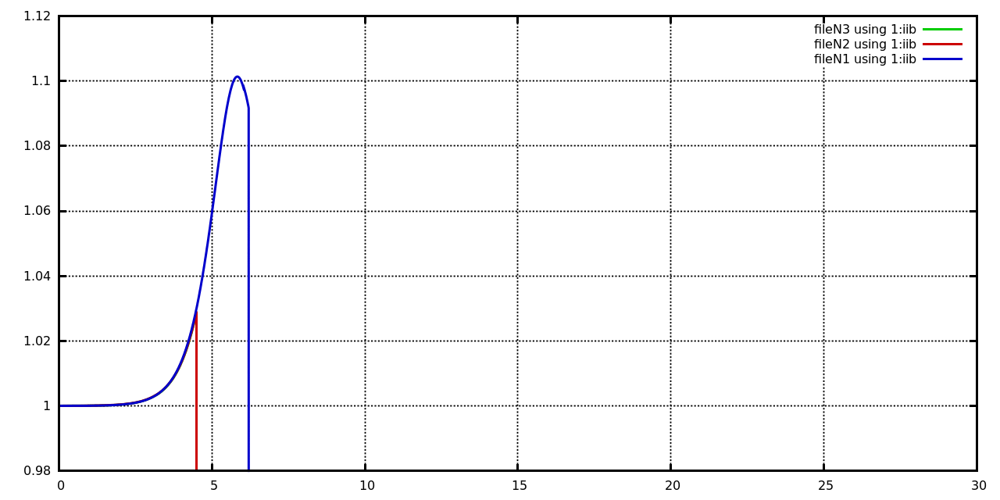 |

### Method-3 : Reg1sc

- No remeshing
- This would be ideal if it works. It would ease the 3D implementation a lot.
- **Note** that in this the overlapping zone is fixed, but each node will have different weight depending on its position in the domain at each time-step.
- Relaxation zone of 1m means 0.2m constant FNPT wei = 1, rest 0.8 overlapping. Relaxation zone pf 5m means 1m constant FNPT wei = 1, rest 4m overlapping.
- We can see in the rlx=1m case that there is a crowding of particle on the top and scarcity at the bottom.
  - Note that this is mostly at the end of the relaxation zone only.
  - This is likely because the mass is moving right from the top and moving left a bit from the bottom. 
  - Due to this there are particles added to the top and removed from the bottom. Hence more particles activated on the top and more particle deactivated in the bottom.
  - Maybe in WCSPH approach the particle density will inform the pressure accordingly to redistribute the particles. Otherwise may have to use a particle redistribution method.
- Alternatively is it because of the relatively quickly change per time-step in the coupling weights?
- I tested again with a longer relaxation zone of 5m.
  - This works well, but can see slight build up of the similar error at the end of the relaxation zone.
  - Also 5m will be too long to use when doing 3D.

| Relaxation zone of 1m length. |
| ----- |
| regBF3_d0p7_T2p0_H0p10_scd1p0_dr050_dt0100_rlx1p00 |
|  |
| 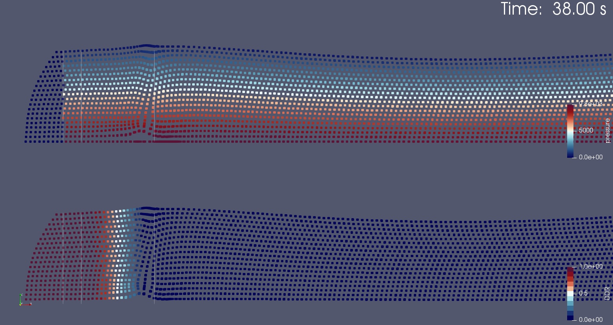 |
| 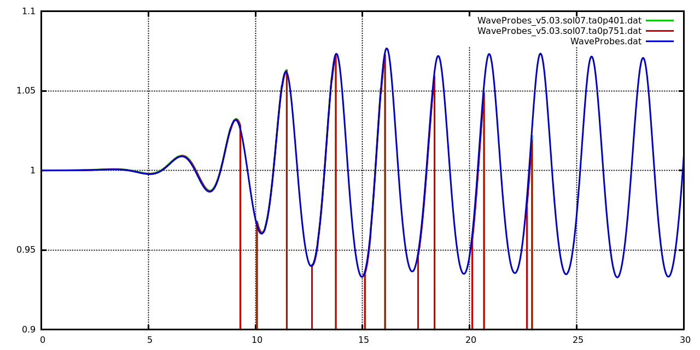 Blue is present result. Green and red are Shagun (2021) results |

| Relaxation zone of 5m length. |
| ----- |
| regBF3_d0p7_T2p0_H0p10_scd1p0_dr050_dt0100_rlx5p00 |
|  |
| 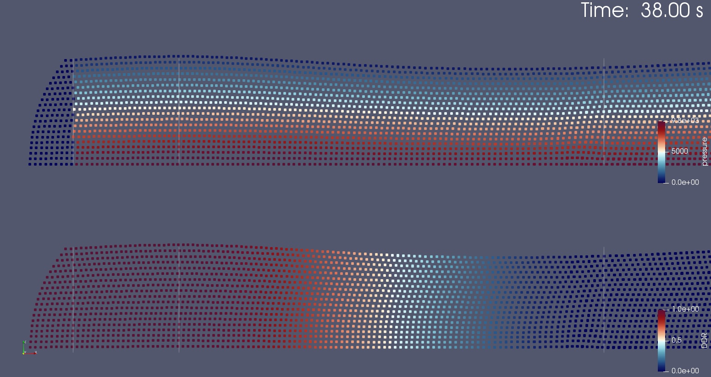 |

### Method-1 : Reg1sc

- No remeshing
- In the Shagun (2021) results also I have done no remeshing.
- This seems to have worked well with no issues.
- Relaxation zone of 1m means 0.2m constant FNPT wei = 1, rest 0.8 overlapping. 

| Relaxation zone of 1m length. |
| ----- |
| regBF1_d0p7_T2p0_H0p10_scd1p0_dr050_dt0100_rlx1p00 |
|  |
| 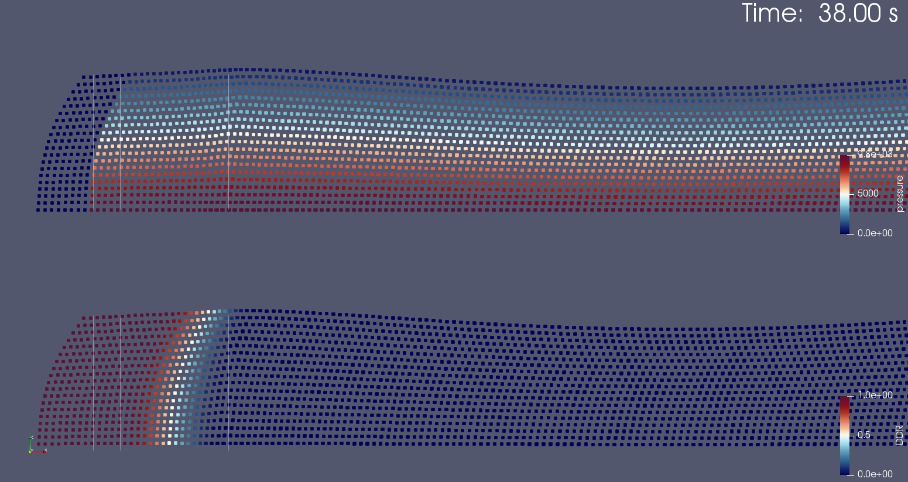 |
|   Blue is present result. Green and red are Shagun (2021) results |

Have to still do further tests with the very long duration regular wave case to find out any long term issues.

-----------------------------------------------

<a name = 'log_mlpgrv01_v0005_1' />

## Open BC one-way coupling left face [2021-09-08]

### Introducing NWALLID(I,2) = -12
These will be abbreviated as nwid2-12 in the code when needed.

- For any fluid or wall particle. (NODEID>=0)
- These are inactive nodes
- Velocity at these nodes from coupling
- Pressure will not be calculated at these nodes. These will be taken as 0 pressure nodes.
- These nodes will be included in free-surface detection
  - Free surface will only be checked for within the inner fixed domain.
- Once this nwid2-12 node crosses into the inner domain, then we set NWALLID(i,2)=0.

#### Location to implement nwid2-12 (Skip for now)

| SN  | Done? | File | Location | Remark |
| --- | ----- | ---- | -------- | ------ |
| 1 |  | interpNew_v1.5 | ASSEMATRIX_MLPG_SHA | Set nwid2-12 nodes same as nwid2-11.   No need to include nwid2-12 in WEIGHTF1 as far as this fnc is concerned. |
| 2 | ND | interpNew_v1.5 | FILL_MATRIX_SHA | Add if condition for nwid12-2 |
| 3 | ND | interpNew_v1.5 | WEIGHTF2_SHA | Used in FILL_MATRIX 2 times only.   Add a section for nwid2-12 neighs for u* part only, not for the P part.  Hence a condition has to be added to WEIGHTF2 |
| 4 |  | mlpgMainSubs | U_UPDATE_POW2 | Skip the operation for nwid2-12. Set same as nwid2-11. |
| 5 |  | interpNew_v1.5 | WEIGHTF1 | Add a condition to include nwid2-12. |

It appears than I can instead just set these buffer layer nodes as nwid2-10 and that will be sufficient. Therefore we document to see if any changes are needed in nwid2-10.

#### Location of nwid2-10

|  SN | File | Function | Description | Same   For   -12? |
| --- | ---- | -------- | ----------- | --------------------- |
| 1 | mlpgMain |  | Related to OUTPUT only | No |
| 2 | interpFnc | WEIGHTF4 | Disables use of nwid2-10 neighs | Yes |
| 3 | interpNew | ASSEMATRIX_MLPG | Sets nwid2-10 pressure as 0 on wall and fluid nodes. Also skips the nwid2-10 neighs. | Yes |
| 5 | interpNew | FILL_MATRIX | Skips for newid2-10 nodes. Also skips the nwid2-10 neighs | Yes |
| 6 | interpNew | VELOCITY_SMOOTH | Skips for newid2-10 nodes. Also skips the nwid2-10 neighs | No |
| 7 | interpNew | PRESSURE_SMOOTH | Skips for newid2-10 nodes. Also skips the nwid2-10 neighs. Sets nwid2-10 pressure as 0 | Yes |
| 8 | interpNew | GHOSTPART | Skips for newid2-10 nodes. Also skips the nwid2-10 neighs. | Yes |
| 9 | interpNew | GHOSTPART_V | Skips for newid2-10 nodes. Also skips the nwid2-10 neighs. | Yes |
| 10 | interpNew | GRADIENT_POM_SHA | Skips the nwid2-10 neighs. | Yes |
| 31 | mlpgMainSubs | U_UPDATE_POW2 | Sets 0 vel 'UX(INOD,1:3)=0d0' for nwid2-10 nodes. | Yes |
| 32 | mlpgMainSubs | U_BOUNDARY | Sets 0 vel for nwid2-10 nodes. | Yes |
| **33** | mlpgMainSubs | JUDGEFREESURFACE_SHA | Assigns nwid2=-10 for all NODEID(-1)+1 to NODEID(0) | DM |
| 34 | mlpgMainSubs | GRADIENT_2P   WEIGHTF_GRAD_2P | Skips for nwid2-10 neighs  | Yes |
| 35 | mlpgMainSubs | FIND_LAPLAC | Sets 0 'UX(INOD,1:2)=0d0' for nwid2-10 nodes. | Yes |
| 36 | mlpgMainSubs | GENERATEGHOST | Assigns nwid2=-10 for the type-6. | DM |
| 37 | mlpgMainSubs | CYLIND3,4 | Assigns nwid2=-10 for the type-6 and type-9. | DM |
| 38 | mlpgMainSubs | SRI2 | Assigns nwid2=-10 for dry type9. | DM |
| 39 | mlpgMainSubs | FINDCYLINFORCE | Skips nwid2-10 nodes. | DM |

Add nwid2-10 conditions in the following places

|  SN | File | Function | Description | Same   For   -12? | Done? |
| --- | ---- | -------- | ----------- | --------------------- | --- |
| 1 | mlpgMainSubs | GRADIENT_2P | Skip for nwid2-10 nodes  | Y | Y |
| 2 | interpNew | GRADIENT_POM_SHA | Skip for nwid2-10 nodes  | Y | Y |

-----------------------------------------------

## References
1. Kamath, A., Alagan Chella, M., Bihs, H., & Arntsen, Ø. A. (2017). Energy transfer due to shoaling and decomposition of breaking and non-breaking waves over a submerged bar. Engineering Applications of Computational Fluid Mechanics, 11(1), 450–466. [link](https://doi.org/10.1080/19942060.2017.1310671)