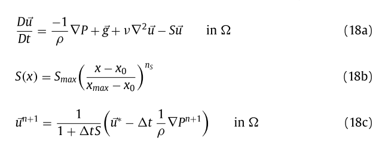
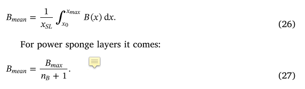
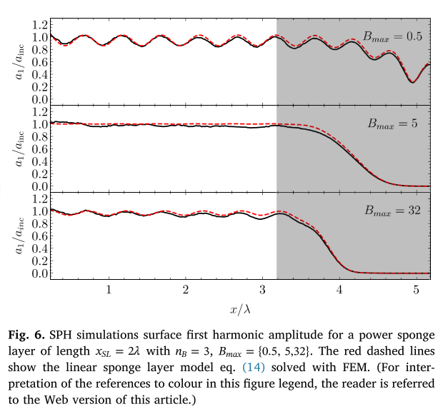
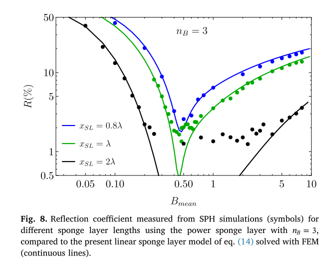
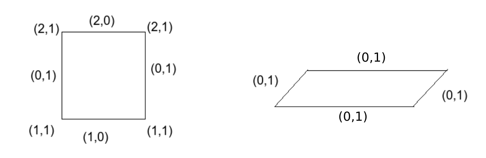

# Common algorithm developments in the code

1. [Write and read resume file [2020-08-08]](#log_mlpgrv01_vAlgo_1)
1. [Cleanup: Removed more PND stuff [2021-04-07]](#log_mlpgrv01_vAlgo_2)
1. [Revisions in Mesh input file [2021-04-08]](#log_mlpgrv01_vAlgo_3)
1. [Correction: Sponge layer BMAX [2021-11-25]](#log_mlpgrv01_vAlgo_4)


## Attempting
- From 2021-04-27 onwards, the common algorithm developments will be noted in this document.
- This log file should only be updated for a branch if the algorithm has been implemented in that branch.


## List of Work
- [x] Write a resume file
- [x] Read a resume file
- [x] Mesh input with node normals and node-edge-type information [link](#log_mlpgrv01_vAlgo_3)
    - [x] node-edge-type stored in BNDEDGETYP(LNODE,2) for use throughout the code. <br> Will be useful for variable bathymetry.

-----------------------------------------------

<a name="log_mlpgrv01_vAlgo_4"></a>

## Correction: Sponge layer BMAX [2021-11-25]

- I have applied a source function based sponge layer where additional terms are added to the momentum eqn.
- However, through some approximation it becomes of the form `u(n+1) = u(n+1)/f`, where f is a ramp. This ramp does go to 0.<br> 
- I have followed the approach of Carmigniani (2017). Here I am using the power function ramp. I am using a cubic ramp.<br> Hence the BMean/SMean = BMAX/4 <br>
- Expect reflections from the beginning of the sponge layer itself.
    - If BMAX is too large there will be large early reflections
    - If BMax is too small then there will be too less absorption and hence reflection from the wall.
    - BMax just right would minimise reflection.<br> 
- Check the following graph. BMean of 0.5-1 is good. <br> I had earlier kept BMAX=10, hence BMean=10/4=2.5. So I had reflections. <br> I am changing BMAX=2 to minimise the reflections.<br> 


### References

1. R. A. Carmigniani and D. Violeau, “Optimal sponge layer for water waves numerical models,” Ocean Eng., vol. 163, no. July 2017, pp. 169–182, Sep. 2018, doi: 10.1016/j.oceaneng.2018.05.068.

-----------------------------------------------

<a name="log_mlpgrv01_vAlgo_3"></a>

## Revisions in Mesh input file [2021-04-08]
- Added the node normal in the mesh input file to be read by the MLPG code in function _CYLIND4()_
- Added a parameter in the mesh input file for each node, called node-edge-type to identify the bottom/top/side points on the boundary faces.
	- Was done to allow the special conditions for these nodes such as interpolated pressure and zero velocity or zero pressure, etc.

| nodedgety | Value | 
| --------- | ----- |
| Bottom | 1,0 |
| Top | 2,0 |
| Side | 0,1 |



-----------------------------------------------


<a name="log_mlpgrv01_vAlgo_2"></a>

## Cleanup: Removed more PND stuff [2021-04-07]
- Removed NUMDEN1() and PND_LAMDA1() from mlpgrMain.f90
- Removed RNODE from the code. 
	- Would have required unnecessary work for sloping case
- Removed vars DN00, DN01, PLAMDA[], DN1[]
- **Note that LAPLACIAN() used some of these things. Though I have commented out LAPLACIAN() for now**

-----------------------------------------------


<a name="log_mlpgrv01_vAlgo_1"></a>

## Write and read resume file [2020-08-08]
- In order to check many algorithms we need to be able to resume from a previous state to shorten the run-time.
- The aim here is to store a state just after remeshing to nicely distributed particles and then test out algorithms for PST or anything else.
- The files will be written in binary, as we had experienced in the Bsnq model.

### Write-Resume
Variables to be written

- ISTEP, TOTAL_TIME
- NODEID(-7:LNODE), NWALLID(LNODE,4)
- COORX(LNODE,3), COORY(LNODE,3), COORZ(LNODE,3)
- SNX(LNODE), SNY(LNODE), SNZ(LNODE)
- SMX(LNODE), SMY(LNODE), SMZ(LNODE)
- SSX(LNODE), SSY(LNODE), SSZ(LNODE)
- DDR(NODEID(0))
- UX(NODEID(0), 1:4), UY(NODEID(0), 1:4), UZ(NODEID(0), 1:4)
- FSSSRCH(NODEID(0))
- P(LNODE)
- PTCSR(NODEID(-1))
    - This is required as the PRESSURE_SOLVER uses this as initial guess of the solution.
    - In the bsnq resume we had noticed that while resuming if we change this initial solution then the result out of the solver will be slightly different and then will change the results henceforth.
    - This had driven me crazy in Bsnq as I expected a point to point match.
    - Although this may be confusing the MLPGR code so maybe avoid it?. It doesnt make any difference in the results. Its just that they wont match point to point

Other possible to be written

- CSUXT1, CSUYT1, CSUZT1
- DDL, DT, H0

Others

- The FNPT coupling initialisation does not need resume file
    - The weight of the MLPG nodes lying in the relaxation zone is decided based on T0 mesh and therefore does not require any resume file
    - The only requirement it to place the file read pointer at the correct position in the FNPT file.

### Read-Resume
- Removed NSTEPTOTAL because it was useless and confusing
    - Replaced NSTEPTOTAL with NSTEPS everywhere
- Removed NSTAGE as it too was useless
- Introduced STEP0. This way IF conditions of ISTART can be kept and we can start the loop from desired resume condition.
- Loop over the FNPT file to get the read pointer in the correct position.

### Results
The resume is unfortunately not point-to-point perfect.
I do not know why.
But the resume seems to work alright.

Below is one example case.
Test case is isope2020_23001_reg0.043_cylAt6.50_L21.R5
Resume file saved at 800 time-step
Below is the error comparison using l2Norm.

l2pp = l2norm(resumed - original) / l2norm(original)

l2pp (PP1 - PP8)
```
0.000074   0.000107   0.000168   0.000752   0.001660   0.000205   0.000282   0.000185
```

l2wp (WP1 - WP9)
```
0.000005   0.000008   0.000008   0.000009   0.000008   0.000008   0.000008   0.000009   0.000009
```

-----------------------------------------------

