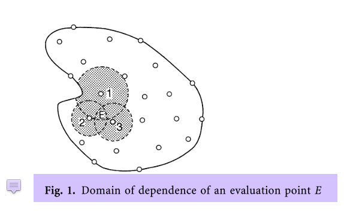
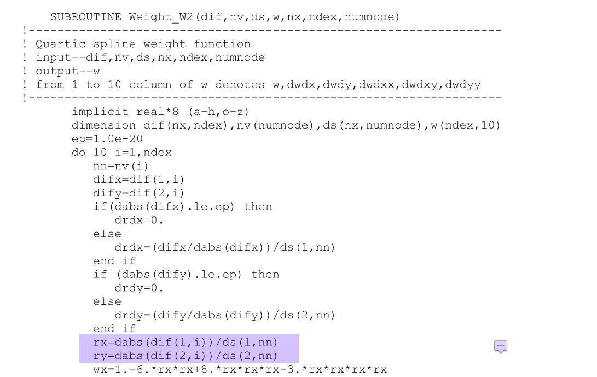
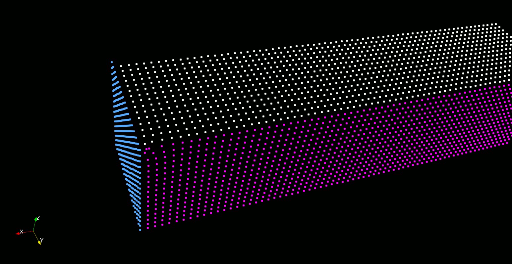

# Common bugs in the code

1. [Major correction in _MLPG_GET_UP()_ [2020-07-13]](#log_mlpgrv01_vBugs_1)
2. [Looping mistake by using NODEID(-7) instead of NODEID(-7)+1](#log_mlpgrv01_vBugs_2)
3. [Changing from RIAV = R(NOD) to RIAV = (R(NOD) + R(NEI))/2 [2021-09-03]](#log_mlpgrv01_vBugs_3)
4. [Curious issue of increasing noise in PPE soln with increasing XYZ [2021-12-16] ](#log_mlpgrv01_vBugs_4)
5. [Providing option of choosing SFDI or MLS [2021-12-28]](#log_mlpgrv01_vBugs_5)


## Attempting
- From 2021-04-27 onwards, the bugs in the main code common across all branches will be noted here.
- This log file should only be updated for a branch if the bug-fix has been done in that branch.


## List of Work
- [x] JUDGEFREESURFACE_SHA: Added the 1d-10 limit in the up-down-left-right algo. Was failing to detect FS particle at left and near side-wall. [2021-10-10]
- [x] U_BOUNDARY2() : Remove the following in 3D coupling
```
    IF(NODEID(INOD).EQ.8)THEN     
      UY(INOD,IK) = 0.D0
      UY(INOD,IK1) = 0.D0
    ENDIF

``` 
Corrected in both BQML and MLPG codes. Not tested.
- [x] In CYLIND4, for type9 nodes, make sure to set NWALLID(NNI,1)=4. <br> This value has confusion due to difference in its function for wall and non-wall nodes.<br> But leaving it as NWALIID(NNI,1)=0 will make the vels zero in U_BOUNDARY. <br> Changed in both MLPG and BQML.


-----------------------------------------------

<a name="log_mlpgrv01_vBugs_5"></a>

## Providing option of choosing SFDI or MLS [2021-12-28]

- As seen in [link](#log_mlpgrv01_vBugs_4), there appeared to be increasing noise in the pressure with increasing XYZ.

- I personally think it is due to MLS interpolation, where the shape function is dependant on the absolute values of the XYZ coords, and not just the distances between the neighs and the point.

- I tried the following things with the MLS codes to try and identify any other causes of the noise. <br> The results are in folder "bqml3D/wbqml01/Test_stokes2b_bqml/bqml_caseS2_all4" and "bqml3D/wbqml01/Test_stokes2b_bqml/bqml_caseS2_all4/solverUnderstand"
    
    - (new4_PTCSR0) : Give PTCSR = 0 as the initial guess to the PPE solver at every time-step.

    - (new4_RCI2p0) : Increase the radius of Gaussian weight function in PRESSURE_SMOOTH_SHA() by changing RCI=2

    - (new4_SmthBiQuad) : Use BiQuad weight function instead of Gaussian weight function in MLS interpolation in PRESSURE_SMOOTH_SHA().

    - (new21) : Smoothen only Pdyn = P - (rho * g * (H0 - z)) instead of the full pressure (new21)

    - (new4_err04, new4_err06, new4_err08) : Change the absolute error limits for PPE

    - (new4_err10_noParallel) : Remove all parallel code (except for the PPE solver)

Nothing removed the increasing noise in pressure with increasing XYZ.

### Analytical Matlab codes

Folder: mlpgr3D/OtherCodes/MLS_and_SFDI_Matlab

I checked using my own MLS code (folder: mlsCheck) for 2D and 3D with BiQuadratic weight function and linear basis function.

- The analytical function is ```val = 5000*cos(2*pi/L*cos(thRad)*x + 2*pi/L*sin(thRad)*y);```
- The neighbours were placed at regular intervals of _dl_.
- We interpolate the value using MLS at the origin, that was shifted around.
- I made sure that the neighbour analytical values were calculated before shifting the origin to ensure no difference in the analytical values at the neighbours due to truncation errors for all test cases.
- The origin was d1(0,0,0.3), d2(6,6,0.3), d3(50,50,0.3) and d4(500,500,0.3) 
- Ideally the interpolated value for cases d1, d2, d3, d4 should be identical.
- However the interpolated values differ in all 4 cases. The results below are with a support domain of _2.83 dl_
    - d1.fn - d2.fn = 1.9552e-09
    - d1.fn - d3.fn = -4.7607e-08
    - d1.fn - d4.fn = 1.0779e-04
- We can observe increasing difference in the interpolated value with increasing XYZ.
- The same was observed with radius _1.8 dl_
- The same was observed in my 2D MLS Matlab code
- The same was observed in the Matlab code from online Matlab forum (folder: MLS2D_matlab) (https://in.mathworks.com/matlabcentral/fileexchange/34547-moving-least-square-mls2d)

This test was repeated for SFDI (folder: sfdi), with the same Biquad weight function, linear basis function, and radius of _1.8 dl_ and _2.83 dl_. In SFDI the interpolated values were identical for cases d1, d2, d3, d4.

It could also be seen that the shape function for regularly spaced neighbours obtained from MLS and SFDI are almost the same (excpet for the small variation in MLS for different XYZ.)


### Implemented SFDI in MLPG code

Folder: bqml3D/wbqml01/Test_checksfdi

- We are using MLS in the following places
    - ASSEMATRIX_MLPG_SHA() <br> for NWALLID3EQ9 pressure interpolation wall nodes
    - FILL_MATRIX_SHA() <br> for calculation of q0, q1, q2, q3, q4, q5, q6 and u1, u3, v2, v4, w5, w6 at the locations in the sphere of integration in the LBIM. <br> also for NWALLID3EQ9 pressure interpolation fluid nodes
    - PRESSURE_SMOOTH_SHA() <br> for smoothening the pressure
    - VELOCITY_SMOOTH_SHA() <br> for smoothening the velocity

- The noise due to MLS appears to be mostly in the solution of out the PPE solver, which is likely due to the FILL_MATRIX_SHA(). Further noise also seems to be coming in PRESSURE_SMOOTH_SHA().
- Therefore I wrote new subroutines to replace the MLS with SFDI
    - FILL_MATRIX_SFDI() in place of FILL_MATRIX_SHA()
    - PRESSURE_SMOOTH_SFDI() in place of PRESSURE_SMOOTH_SHA()

The results below are comparison between<br>
MLS : bqml3D/wbqml01/Test_checksfdi/bqmlall4_R030_caseS2a_6x6_dx042_dt010_A0p6_new4_err10 <br>
SFDI : bqml3D/wbqml01/Test_checksfdi/bqmlall4_R030_caseS2a_6x6_dx042_dt010_A0p6_new46_err06 

|     |
| --- |
| **Pdyn = P - (rho  g  (H0-z))** |
| MLS |
|  |
| SFDI |
|  |
|  |
| **P and UZ along a line running from (0.2,0.2,0.375) to (5.8,5.8,0.375) at t = 55s = 13.75 wavT** |
| MLS |
|  |
| SFDI |
|  |
|  |

From this it can be seen that SFDI in pressure functions did solve the noise issue.

Additional observations include

- With regards to coupling with Bsnq, I do NWALLID3EQ9 differently for the MLS and SFDI codes as shown in the figure below. In SFDI when I did only for the corner nodes, the convergence was extremely slow in PPE **(as seen in new45_errxx)**. <br> In any case, I feel we should be doing NWALLID3EQ9 for all outer-layer nodes when coupling with Bsnq because doing MLPG for these nodes will be incorrect as they only have a hemisphere where the LBIM integration should have been done, but our default approach is to do it for the complete sphere. <br> Additionally we have 2-3 layer minimum of the CPLSTAT2, therefore making just the outermost as NWALLID3EQ9 may not be too bad. <br>  

- MLS abs tol set to 10^-10 is achieved with fewer iterations (140 - 200s). <br> However SFDI ans tol set to 10^-10 is achieved with 2500-3300 iterations!!!! <br> SFDI abs tol changed to 10^-6 is achieved in 150-200 iterations.
    - I do not know the reason behind this.
    - In any case in Bsnq I use 10^-4 and 10^-6 seems more sensible that the 10^-10 choice.

For definition of other trials in "bqml3D/wbqml01/Test_stokes2b_bqml/bqml_caseS2_all4" and "bqml3D/wbqml01/Test_checksfdi", refer to "bqml3D/wbqml01/Dev - Logs/log_wbqml01_v0002.md" topic _Trials of input from all 4 directions [2021-12-28]_

-----------------------------------------------


<a name="log_mlpgrv01_vBugs_4"></a>

## Curious issue of increasing noise in PPE soln with increasing XYZ [2021-12-16]

Folder: wbqml01/Test_stokes2b_bqml/bqml_caseS2_all4/solverUnderstand

- While coupling with Bsnq in 3D, I tried a domain 6x6 domain.
- I noticed that there was increasing noise in the soln of PPE with increasing XYZ. <br>This can be seen in the P_dynamic (=P-&rho;g(H0-h)) values.
- This issue has nothing to do with the Bsnq coupling. It was seen even in the cylinder cases.


The following image is from a 6x6 domain between (0,0) and (6,6)

- Case-name 'bqmlall4_R030_caseS2a_6x6_dx042_dt010_A0p6_new4_err10'
- The following is at t=0, i.e. the 0th time-step of MLPG, where the pressure is calculated using initial vels (=0). <br> 
- Notice the noise in the top right corner. The magnitude of this noise in P_dynamic is 0.4 Pa. 
- This noise is not present only at t=0. Its also there once the wave arrives. <br>
- When I was coupling with Bsnq, this corner was exploding coz of this error. In the coupling I do not provide the UZ, which is calculated from the normal MLPG procedure. Due to this noise in pressure, the UZ used to have noise and accumulation of this noise lead to a failure within 200 time-steps.<br>
- I sorted this by using the eta information from Bsnq at these nodes. After this the code ran fine, but still we could see the this region did have more noise than rest as seen below.<br>


Now the question is, what is causing this noise. I can handle the issue through ad-hoc methods such as enforcing eta from Bsnq. But what is the root cause?

I tested using a 6x6 domain between (0,-6) and (6,0).

- The aim was to identify, 
    - is the noise particularly at that corner? 
    - is the noise due to increase in error with increasing XYZ?
- The following is the still at t=0.<br>
- Hence it appears that this noise increases with increasing XYZ.
- The same can also been seen in our focusing wave results.<br> The following is from 'Trial 9/Test Focused 2/mlpgr_3DS_v5.02.f23002c.dt0075.m24.R30' <br> P_dynamic at t=0 <br> 

## Root cause possibility 1

- If we look at the PPE in MLPG, its actually very simple<br> 
- So all of the q1, q2, ... and u1, u3, v2, ... are found using MLS.
- If we look at the MLS shape fnc below, it has terms corresponding to XYZ values. **Is this causing the issue?** <br> 
- In order to monitor this I took the row of A in AX=B at 2 nodes
    - n1 = 193917       0.250000       0.250000       0.375000
    - n2 = 214509       5.750000       5.750000       0.375000
- I expect these two to have the exact same coeffs.
- The following plot is of their neighbour's relative position w.r.t n1 and n2, i.e. (r(nei) - r(n1)) and (r(nei) - r(n2)). It is identical for both n1 and n2, hence they have the neighbour at exactly the same relative position. <br>  
- Next we look at their coeffs in the A matrix.

```
    n1
    193917       0.250000       0.250000       0.375000

                 DDR            R              R0    
    193917       0.075001       0.064584       0.010417
        33
    169892       0.250000       0.250000       0.333333      -0.001390
    193762       0.250000       0.208333       0.375000      -0.001390
    193916       0.208333       0.250000       0.375000      -0.001390
    193918       0.291667       0.250000       0.375000      -0.001390
    194072       0.250000       0.291667       0.375000      -0.001390
    217942       0.250000       0.250000       0.416667      -0.001390
    169737       0.250000       0.208333       0.333333       0.001852
    169891       0.208333       0.250000       0.333333       0.001852
    169893       0.291667       0.250000       0.333333       0.001852
    170047       0.250000       0.291667       0.333333       0.001852
    193761       0.208333       0.208333       0.375000       0.001852
    193763       0.291667       0.208333       0.375000       0.001852
    194071       0.208333       0.291667       0.375000       0.001852
    194073       0.291667       0.291667       0.375000       0.001852
    217787       0.250000       0.208333       0.416667       0.001852
    217941       0.208333       0.250000       0.416667       0.001852
    217943       0.291667       0.250000       0.416667       0.001852
    218097       0.250000       0.291667       0.416667       0.001852
    169736       0.208333       0.208333       0.333333       0.001252
    169738       0.291667       0.208333       0.333333       0.001252
    170046       0.208333       0.291667       0.333333       0.001252
    170048       0.291667       0.291667       0.333333       0.001252
    217786       0.208333       0.208333       0.416667       0.001252
    217788       0.291667       0.208333       0.416667       0.001252
    218096       0.208333       0.291667       0.416667       0.001252
    218098       0.291667       0.291667       0.416667       0.001252
    193915       0.166667       0.250000       0.375000       0.000076
    193607       0.250000       0.166667       0.375000       0.000076
    145867       0.250000       0.250000       0.291667       0.000076
    241967       0.250000       0.250000       0.458333       0.000076
    194227       0.250000       0.333333       0.375000       0.000076
    193919       0.333333       0.250000       0.375000       0.000076
    193917       0.250000       0.250000       0.375000      -0.024353
```

```
    n2
    214509       5.750000       5.750000       0.375000

                 DDR            R              R0        
    214509       0.075001       0.064584       0.010417
        33
    190484       5.750000       5.750000       0.333333      -0.001503
    238534       5.750000       5.750000       0.416667      -0.001493
    214354       5.750000       5.708333       0.375000      -0.001520
    214508       5.708333       5.750000       0.375000      -0.001488
    214510       5.791667       5.750000       0.375000      -0.001511
    214664       5.750000       5.791667       0.375000      -0.001489
    190329       5.750000       5.708333       0.333333       0.001825
    190483       5.708333       5.750000       0.333333       0.001834
    190485       5.791667       5.750000       0.333333       0.001828
    190639       5.750000       5.791667       0.333333       0.001833
    238379       5.750000       5.708333       0.416667       0.001828
    238533       5.708333       5.750000       0.416667       0.001838
    238535       5.791667       5.750000       0.416667       0.001832
    238689       5.750000       5.791667       0.416667       0.001838
    214353       5.708333       5.708333       0.375000       0.001829
    214355       5.791667       5.708333       0.375000       0.001823
    214663       5.708333       5.791667       0.375000       0.001838
    214665       5.791667       5.791667       0.375000       0.001832
    190328       5.708333       5.708333       0.333333       0.001252
    190330       5.791667       5.708333       0.333333       0.001251
    190638       5.708333       5.791667       0.333333       0.001253
    190640       5.791667       5.791667       0.333333       0.001252
    238378       5.708333       5.708333       0.416667       0.001252
    238380       5.791667       5.708333       0.416667       0.001252
    238688       5.708333       5.791667       0.416667       0.001253
    238690       5.791667       5.791667       0.416667       0.001253
    214199       5.750000       5.666667       0.375000       0.000076
    214507       5.666667       5.750000       0.375000       0.000076
    214819       5.750000       5.833333       0.375000       0.000076
    214511       5.833333       5.750000       0.375000       0.000076
    166459       5.750000       5.750000       0.291667       0.000076
    262559       5.750000       5.750000       0.458333       0.000076
    214509       5.750000       5.750000       0.375000      -0.024774
```


- I plot these coeffs using the positionns of the neighbour. <br> The position of the neighs in the plot below are <br> ( x(nei)-x(n1)-coef(nei), y(nei)-y(n1), z(nei)-z(n1) ). <br> Same was done for n2. 
- From the output files and the plots you can see the small difference in the coeffs, especially in the diagonal value.
- Is this difference the cause of the issue?
- When setting up the PPE, we had found that using MLS for the derivative in delP.n=0 lead to very slow convergence and unstable soln. 
    - Due to this SFDI was used. SFDI does not have any terms dependent on the XYZ values. Everything in that is relative.
- **Is MLS causing the issue here too?**
- <span style="color:red">Should we use SFDI instead of MLS for this part too and see how the results change?</span>.
    - Changing to SFDI did remove this issue. 
    - Documented in [link](#log_mlpgrv01_vBugs_5)


-----------------------------------------------


<a name="log_mlpgrv01_vBugs_3"></a>

## Changing from RIAV = R(NOD) to RIAV = (R(NOD) + R(NEI))/2 [2021-09-03]

- I had made a mistake in understanding the support domain.
- Support domain is actually influence domain
- The spherical (assumed) influence domain of the node is the spherical region around the node where its value will have a influence
- Let say you have a point 'x' where you need to interpolate as shown in the following figure.<br>
- The dots are the nodes at which you have information.
- The circles are the support (influence) domain of the dots.
- The domain of dependence of 'x' will actually then be a combination of these circles.<br>Ref. Mukherjee (1997) <br> 
- This is true for all particle based methods such as MLS, RPIM, where the value at a position 'x' are obtained using known values at the 'dots'.
- If you check the GR Liu book for the MLS code, it is clearly seen using the radius of each 'dot' neighbour and not a radius for 'x'.<br><br>
- Therefore in all places where we do interpolation, I have changed it to RIAV = R(NEI).
- However for the MLPG part we need a Petrov-Galerkin behaviour in the system of eqn AX=B
    - If 'j' has non-zero coeff for node (row) 'i', then it would be good to have non-zero coeff for 'i' in node (row) 'j'.
- This is why we do RIAV = (R(NOD) + R(NEI))/2 to avoid the extreme condition depicted in the sketch below.<br>

### List of places where edit was made

| SN  | File | Function <br> Num of Edits | Description |
| --- | ---- | -------- | ----------- |
| 1 | mlpgMainSubs.f | WEIGHTF_GRAD_2P() <br>1c | part of GRADIENT_2P() |
| 2 | interpNew_v1.5.f90 | WEIGHTF1_SHA() <br>4c | part of NWALLID(INOD,3).EQ.9, smoothing vel and press, ghost pressure and vel |
| 3 | interpNew_v1.5.f90 | WEIGHTGRADF1_SHA() <br>1c | part of ASSEMMATRIX and GRADIENT_P_CYL |
| 4 | interpNew_v1.5.f90 | WEIGHTF2_SHA() <br>1c | part of FILLMATRIX |
| 5 | interpNew_v1.5.f90 | GRADIENT_POM_SHA() <br>6c |  |
| 6 | interpFnc_v1.5.f90 | WEIGHTF4_SHA() <br>1c | Part of MLPG_GET_UP2() <br> Required changes in mlpgrMain.f90 too. |
| 7 | interpFnc_v1.5.f90 | WEIGHTF3_XY_SHA() <br>1c | Part of MLPG_GET_ETA() <br> Required changes in mlpgrMain.f90 too. <br> Added variable DDRFS <br> Changes in GEN_FNPT_3D(). |
| 8 | interpFnc_v1.5.f90 | WEIGHTF3_SHA() <br>1c | Part of MLPG_GET_UP() <br> Added variable DDR to DOMAINMOD in modules_v3.1.f90 <br> Changes to GEN_FNPT_3D() and mlpgrMain.f90 <br> Currently took influence radius as 2.2DDL instead of finding the actual radius using NODELINK for this part alone. |

Other changes were

- Ghost particles (type-9 and type-6) given the radius of the associate fluid particle.
    - Done inside GENERATEGHOST() <br> Because this function is always called just after the NODELINK subroutine.

### Observations [2021-09-09]
I tested two case

- **Test1** : Focusing wave 23001 case 
- **Test2** : The very long duration damping test case with T=2.0, H=0.1, h=0.7 scaled to h=1.0

The observations can be seen in probe and flux in/out measurements in the folder **Test_supportDomain**.

| Name | Description |
| ---- | ----------- |
| orig | The original RIAV = R(NOD) everywhere |
| modAllExceptProbes | Changed to RIAV = ( R(NOD)+R(NEI) )/2 everywhere except the probes part (See [list of edits](#list-of-places-where-edit-was-made). Done 1-5) |
| modAllExceptProbe_probeUP2 | Changed RIAV = R(NEI) for probes in function MLPG_GET_UP2 only. (See [list of edits](#list-of-places-where-edit-was-made). Done 1-6) |
| modAllExceptProbeUP | Changed RIAV = R(NEI) for probes in function MLPG_GET_UP2 and MLPG_GET_ETA. (See [list of edits](#list-of-places-where-edit-was-made). Done 1-7) |
| modAll | Changed RIAV = R(NEI) for probes in function MLPG_GET_UP2, MLPG_GET_ETA and MLPG_GET_UP. (See [list of edits](#list-of-places-where-edit-was-made). Done 1-8) |


There is an observable marginal difference between orig and modAll in peak and through of the waves, slight difference in phase especially in Test2. <br> There is also marginal difference in flux in/out as seen in Test1 results.


### References
1. Y. X. Mukherjee and S. Mukherjee, “On boundary conditions in the element-free Galerkin method,” Comput. Mech., vol. 19, no. 4, pp. 264–270, 1997, doi: [10.1007/s004660050175](https://www.doi.org/10.1007/s004660050175).

2. G. R. Liu and Y. T. Gu, An Introduction to Meshfree Methods and Their Programming. Berlin/Heidelberg: Springer-Verlag, 2005.

-----------------------------------------------


<a name="log_mlpgrv01_vBugs_2"></a>

## Looping mistake by using NODEID(-7) instead of NODEID(-7)+1

Something unusual was observed when I was doing the bottom stationary and sloping bottom development [link](./log_mlpgrv01_v0004.md#log_mlpgrv01_v0004_2)

Something unusual has been happening at the top right corner.<br>
In the old code without remeshing we see disturbance like seen below at that corner <br> 


However in the new code with bottom points stationary we face some issues for leakage. <br>
This leak is when we allow Y-axis motion for type3 oppWM nodes and do not use the interface. (slip BC results here. but similar in no-slip)  <br> 


We remove Y axis motion for the type3 oppWM nodes, as was the case in the old code. This alone doesnt solve the leak <br>
We then implemented the interface at the opposite side (near type8) nodes, where the type2 nodes with dry neighs were made to have MLS extrapolation of pressure.<br>
With this change it solved the leak issue on this corner<br>
Note that due to the weak form, changes at one end can change results at the opposite end due to the change in the condition of the matrix.<br>


**Note that the issue is seemingly caused due to the top right corner particle in the far-sidewall being stationary**

### Reason for the issue
- There was a mistake made long ago in functions such as _FIXCYLINDER()_ where I had by mistake done looping from `NODEID(-7), NODIEID(-1)` instead of `NODEID(-7)+1, NODIEID(-1)`. 
- Due to this a far side-wall particle at the top right corner was being made stationary and caused issues.
- This was resolved in this function and other places with NODEID(-1) (though the other places were largely harmless.)

The solution worked as seen below for a constant bathymetry case. <br>


-----------------------------------------------


<a name="log_mlpgrv01_vBugs_1"></a>

## Major correction in _MLPG_GET_UP()_ [2020-07-13]
I had made the following mistake by adding `A(4,4) = 1` in the following part of this subroutine.

```
    CALL BASEFUN_SHA(4,PT,XQ,YQ,ZQ)

    A(4,4) = 1

    CALL FINDINV4X4(A,AINV,WWI)    
```

This was done in _MLPG_GET_ETA()_ in order to continue using the 3D subroutines for the 2D operation and thus remove the Z axis's role by making the Z corresponding part as 0 and its diagonal as 1.

However for some stupid reason I also did the same in _MLPG_GET_UP()_, which was obviously wrong.

Somehow the interpolation of velocities and pressure was working fine after remeshing, which is a major question.

The following correction has been made.
```
    CALL BASEFUN_SHA(4,PT,XQ,YQ,ZQ)

    CALL FINDINV4X4(A,AINV,WWI)    
```

**Important to test this now.**

### Tested using focusing wave with cylinder
Tested using case 'f23002c.dt0100.m24.R30' and compared against the results obtained with the above mistake.

**I was hoping that the correction of this mistake would remove the discontinuities in the pressure probes when we do remeshing. But it did not solve that issue.**

There is hardly any difference between the results (surprisingly). After the steepest wave there seems to be lesser dissipation.

Both the codes were run on the same system.

<details>
    <summary>Input file</summary>

```
Q) H0 (m)
1.0
Q) DDL Avg. distance between nodes (m)
0.05

Q) Scale factor to determine the domain of influence 
1.55
Q) Coefficient for Gauss Weight
1
Q) Number of components in base function 
4

Q) Time-Step (s), Starting time (s), Number of time-steps
0.010d0, 0, 4700
Q) Printout - End of Freq1, Freq1, Freq2
4700, 90, 60                
Q) Start time-step, End time-step
0, 4700

Q) Viscosity On? (0/1), Kinematic viscosity
0, 1.D-6 
Q) Wave-maker type (0-No wavemaker, 1-Flap, 2-piston, 15-FNPT)
15          
Q) Enable elastic structure? (0/1)            
0

Q) Number of OpenMP Threads
8

Q) Maximum number of nodes (LNODE)
620000

Q) Name of mesh-file
CylTank_reg0.05_cylAt7.00_L30.R.dat
Q) Domain Bottom Left (X, Y, Z) (m, m, m)
0 0 0
Q) Domain Top Right (X, Y, Z) (m, m, m)
30 1.6 1.0
Q) Cylinder (Centre-X Centre-Y Radius)
7.00d0 0.80d0 0.157d0

Q) X Location of Sponge layer start (before right-wall)
20.00
Q) Remeshing Freq (=0 to disable)
30

Q) Wave probe numbers and locations (nProbe | X Y )
9
0D0     0.8D0
3D0     0.8D0
6.1857D0    1.3D0
7.0000D0    1.3D0
8.0071D0    1.3D0
8.5000D0    1.3D0
9.0000D0    1.3D0
10.0000D0   1.3D0
11.0000D0   0.8D0

Q) Pressure probe number and location (nProbe | X Y Z)
8
6.840d0     0.8000d0    0.5928D0
6.840d0     0.8000d0    0.7357D0
6.840d0     0.8000d0    0.8786D0
6.840d0     0.8000d0    1.0214D0
6.840d0     0.8000d0    1.1643D0
6.8496D0    0.8547D0    0.8786D0
7.0000D0    0.9600D0    0.8786D0
7.1600D0    0.8000D0    0.8786D0


---- FNPT Coupling for Wavemaking ----
Q) Data file name
'../Output PHIT2 f23002o2.dt010.S28.dat'
Q) NX NY
81  21
Q) DDL
0.05d0
Q) Coupling X0
28.5429D0
Q) Coupling relaxation zone length
1d0
-- END FNPT Coupling for Wavemaking --

```
</details>

<details>
    <summary>Wave probes</summary>

| Wave probes. With mistake (Purple). Corrected (Green) |
| :-------------: |
| **Figure :** WP1 |
|  |
| **Figure :** WP2 |
|  |
| **Figure :** WP3 |
|  |
| **Figure :** WP4 |
|  |
| **Figure :** WP5 |
|  |
| **Figure :** WP6 |
|  |
| **Figure :** WP7 |
|  |
| **Figure :** WP8 |
|  |
| **Figure :** WP9 |
|  |

</details>

<details>
    <summary>Pressure probes</summary>

| Pressure probes. With mistake (Purple). Corrected (Green) |
| :-------------: |
| **Figure :** PP1 |
|  |
| **Figure :** PP2 |
|  |
| **Figure :** PP3 |
|  |
| **Figure :** PP4 |
|  |
| **Figure :** PP5 |
|  |
| **Figure :** PP6 |
|  |
| **Figure :** PP7 |
|  |
| **Figure :** PP8 |
|  |

</details>

-----------------------------------------------


-----------------------------------------------